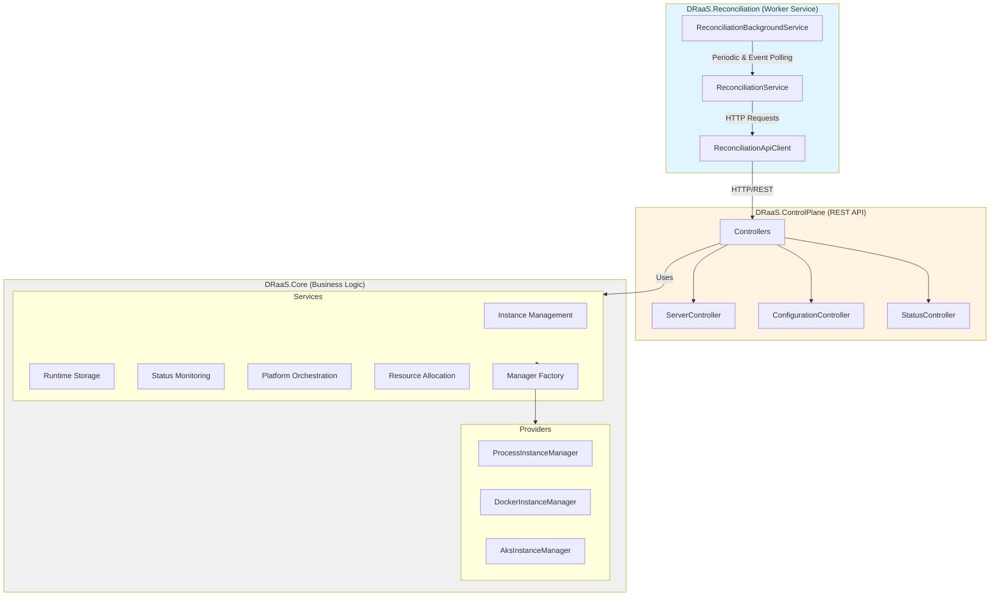
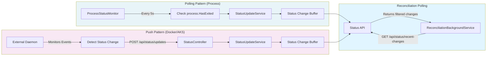
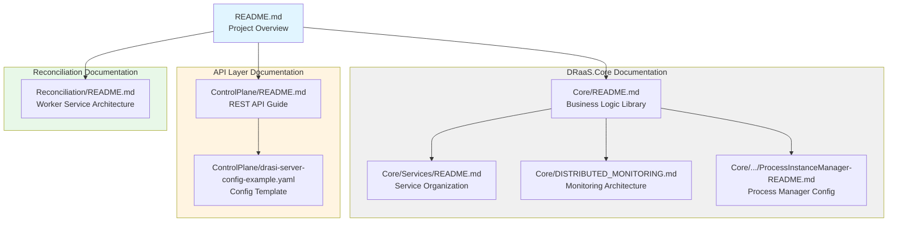

# DRaaS - Drasi as a Service

**Multi-Instance Management Platform for Drasi Servers**

DRaaS provides a comprehensive control plane for managing multiple [Drasi](https://drasi.io/) server instances across different hosting platforms. It abstracts platform complexity, enabling teams to deploy and monitor Drasi instances without direct infrastructure management.

## Overview

DRaaS is a **platform-agnostic orchestration system** that manages the complete lifecycle of Drasi server instances. It provides:

- ✅ **Multi-Instance Management**: Create, configure, and manage multiple isolated Drasi instances
- ✅ **Platform Abstraction**: Deploy to Process (bare metal), Docker, or Azure Kubernetes Service (AKS)
- ✅ **Automatic Resource Allocation**: Platform managers determine their own resource requirements (host, port)
- ✅ **Bidirectional Status Monitoring**: Polling for local processes, push-based for distributed platforms
- ✅ **Configuration Management**: Full CRUD operations on Drasi server configurations (sources, queries, reactions)
- ✅ **Modular Architecture**: Reusable business logic library (Core) with pluggable interfaces (ControlPlane)

## Architecture

DRaaS follows **Clean Architecture** principles with clear separation between business logic and interface layers:



### System Components

1. **DRaaS.Reconciliation** - Standalone worker service that ensures desired state convergence
   - Polls ControlPlane API for status changes
   - Detects configuration drift
   - Applies reconciliation strategies via API calls

2. **DRaaS.ControlPlane** - REST API layer exposing HTTP endpoints
   - Instance lifecycle operations (create, start, stop, restart, delete)
   - Configuration management (CRUD operations)
   - Status event streaming for reconciliation

3. **DRaaS.Core** - Reusable business logic library
   - Platform-agnostic services
   - Platform-specific managers
   - Domain models and interfaces

### Key Design Principles

1. **API-First Architecture**: All external components (Reconciliation) communicate through ControlPlane API
2. **Separation of Concerns**: Core (business logic) is independent of ControlPlane (Web API) and Reconciliation (Worker)
3. **Interface Segregation**: Small, focused interfaces for each responsibility
4. **Dependency Inversion**: Platform managers implement interfaces, orchestrator coordinates
5. **Open/Closed Principle**: Add new platforms or reconciliation strategies without modifying existing code
6. **Platform-Driven Resource Allocation**: Managers determine their own requirements

## Core Features

### 🎯 Multi-Instance Management

Create and manage multiple isolated Drasi instances:

```bash
POST /api/server/instances
{
  "name": "analytics-prod",
  "description": "Production analytics instance"
}
```

**Response**:
```json
{
  "instance": {
    "id": "abc-123",
    "name": "analytics-prod",
    "platformType": "Process",
    "status": "Created",
    "createdAt": "2025-01-28T10:00:00Z"
  },
  "serverConfiguration": {
    "host": "127.0.0.1",
    "port": 8080,
    "logLevel": "info"
  }
}
```

### 🖥️ Platform Abstraction

Deploy to three platforms with automatic selection and resource allocation:

| Platform | Description | Resource Allocation | Monitoring |
|----------|-------------|---------------------|------------|
| **Process** | Bare metal OS processes | `127.0.0.1` + allocated port | Polling (5s intervals) |
| **Docker** | Docker containers | `0.0.0.0` + allocated port | Push (daemon) |
| **AKS** | Kubernetes pods | `0.0.0.0:8080` (K8s service) | Push (daemon) |

Platform managers implement `IDrasiServerInstanceManager` and determine their own hosting parameters:

```csharp
public Task<ServerConfiguration> AllocateResourcesAsync(IPortAllocator portAllocator)
{
    // Process manager knows it needs localhost
    var port = portAllocator.AllocatePort();
    return new ServerConfiguration { Host = "127.0.0.1", Port = port };
}
```

#### Process Platform Configuration

`ProcessInstanceManager` launches drasi-server instances as local processes using YAML configuration. Configure in `appsettings.json`:

```json
{
  "ProcessInstanceManager": {
    "ExecutablePath": "drasi-server",
    "InstanceConfigDirectory": "./drasi-configs",
    "DefaultLogLevel": "info",
    "ShutdownTimeoutSeconds": 5,
    "WorkingDirectory": "./drasi-runtime"
  }
}
```

When creating an instance with `platformType: "Process"`, the system:

1. Generates a drasi-server YAML config file from the stored `Configuration` (sources, queries, reactions)
2. Saves it to `{InstanceConfigDirectory}/{instanceId}-config.yaml`
3. Launches: `drasi-server --config {configFile}`
4. Tracks the process with PID
5. Monitors health and publishes status changes

**Example Generated YAML**:
```yaml
id: my-instance
host: 127.0.0.1
port: 8080
logLevel: info
persistConfig: true
persistIndex: false

sources:
  - kind: postgres
    id: my-db
    autoStart: true

queries:
  - id: my-query
    query: |
      MATCH (n) RETURN n
    sources:
      - sourceId: my-db

reactions:
  - kind: log
    id: log-output
    queries: [my-query]
```

See:
- [ProcessInstanceManager Configuration Guide](src/DRaaS.Core/Providers/InstanceManagers/ProcessInstanceManager-README.md)
- [Example YAML Configuration](src/DRaaS.ControlPlane/drasi-server-config-example.yaml)
- [drasi-server Documentation](https://github.com/samirbanjanovic/drasi-server)

### 📊 Bidirectional Status Monitoring

Two monitoring patterns based on platform architecture:



**Status Flow**:
1. **Local Process Monitoring**: `ProcessStatusMonitor` polls every 5s, publishes to `StatusUpdateService`
2. **Remote Daemon Monitoring**: External daemons POST status changes to `/api/status/updates`
3. **Buffer & API**: `StatusUpdateService` maintains rolling buffer (last 1000 changes)
4. **Reconciliation Polling**: `ReconciliationBackgroundService` polls `/api/status/recent-changes` for `ConfigurationChanged` events
5. **Event-Driven Reconciliation**: Immediate response to configuration changes via API polling

### ⚙️ Configuration Management

Full CRUD operations on Drasi configurations using **JSON Patch (RFC 6902)**:

```bash
PATCH /api/configuration/instances/abc-123
Content-Type: application/json-patch+json

[
  {
    "op": "add",
    "path": "/sources/-",
    "value": {
      "kind": "postgresql",
      "id": "my-db",
      "autoStart": true
    }
  },
  {
    "op": "add",
    "path": "/queries/-",
    "value": {
      "id": "active-users",
      "queryText": "MATCH (u:User) WHERE u.active = true RETURN u",
      "sources": [{ "sourceId": "my-db" }]
    }
  }
]
```

**Configuration Model** (matches Drasi server.yaml):

```yaml
host: 127.0.0.1
port: 8080
logLevel: info

sources:
  - kind: postgresql
    id: my-db
    autoStart: true

queries:
  - id: active-users
    queryText: "MATCH (u:User) WHERE u.active = true RETURN u"
    sources:
      - sourceId: my-db

reactions:
  - kind: webhook
    id: notify-slack
    queries: [active-users]
```

### 🔌 Modular Architecture

**DRaaS.Core** is a reusable library that can be consumed by any .NET application:

- **Web API** (current): ASP.NET Core REST API
- **Console App**: CLI tool for automation
- **Desktop App**: WPF/MAUI visual manager
- **Azure Function**: Serverless event-driven management
- **gRPC Service**: High-performance binary protocol

```csharp
// Console Application Example
var services = new ServiceCollection();
services.AddSingleton<IDrasiInstanceService, DrasiInstanceService>();
// ... register Core services

var serviceProvider = services.BuildServiceProvider();
var instanceService = serviceProvider.GetRequiredService<IDrasiInstanceService>();

var instance = await instanceService.CreateInstanceAsync("my-instance");
```

## Technology Stack

### Core Library
- **.NET 10.0** - Target framework
- **YamlDotNet 16.3.0** - YAML serialization for Drasi configs
- **Microsoft.AspNetCore.JsonPatch 10.0.2** - JSON Patch support

### Web API (ControlPlane)
- **ASP.NET Core 10.0** - Web framework
- **Microsoft.AspNetCore.Mvc.NewtonsoftJson** - Required for JsonPatch
- **Scalar.AspNetCore** - Modern OpenAPI documentation UI

## Project Structure

```
src/
├── DRaaS.Core/                        # Reusable business logic library
│   ├── Models/                        # Domain models
│   │   ├── Configuration.cs           # Drasi server configuration
│   │   ├── DrasiInstance.cs           # Instance metadata
│   │   ├── InstanceRuntimeInfo.cs     # Runtime state
│   │   ├── PlatformType.cs            # Enum: Process, Docker, AKS
│   │   ├── Query.cs, Source.cs, Reaction.cs
│   │   └── ServerConfiguration.cs     # Server settings
│   │
│   ├── Services/                      # Business logic services
│   │   ├── Instance/                  # Instance lifecycle
│   │   │   ├── IDrasiInstanceService.cs
│   │   │   └── DrasiInstanceService.cs
│   │   ├── Storage/                   # Runtime persistence
│   │   │   ├── IInstanceRuntimeStore.cs
│   │   │   └── InMemoryInstanceRuntimeStore.cs
│   │   ├── ResourceAllocation/        # Port management
│   │   │   ├── IPortAllocator.cs
│   │   │   └── PortAllocator.cs
│   │   ├── Monitoring/                # Status monitoring
│   │   │   ├── IStatusUpdateService.cs
│   │   │   ├── StatusUpdateService.cs
│   │   │   ├── IStatusMonitor.cs
│   │   │   └── ProcessStatusMonitor.cs
│   │   ├── Orchestration/             # Platform coordination
│   │   │   ├── IPlatformOrchestratorService.cs
│   │   │   └── PlatformOrchestratorService.cs
│   │   └── Factory/                   # Manager selection
│   │       ├── IInstanceManagerFactory.cs
│   │       └── InstanceManagerFactory.cs
│   │
│   ├── Providers/                     # Platform implementations
│   │   ├── IDrasiServerInstanceManager.cs
│   │   ├── IDrasiServerConfigurationProvider.cs
│   │   ├── DrasiServerConfigurationProvider.cs
│   │   └── InstanceManagers/
│   │       ├── ProcessInstanceManager.cs
│   │       ├── DockerInstanceManager.cs
│   │       └── AksInstanceManager.cs
│   │
│   ├── README.md                      # Core architecture documentation
│   ├── DISTRIBUTED_MONITORING.md      # Monitoring architecture
│   └── Services/README.md             # Service organization guide
│
└── DRaaS.ControlPlane/                # Web API frontend
    ├── Controllers/                   # REST API endpoints
    │   ├── ServerController.cs        # Instance management
    │   ├── ConfigurationController.cs # Configuration CRUD
    │   └── StatusController.cs        # Daemon status updates
    ├── DTOs/                          # API request/response models
    │   └── CreateInstanceRequest.cs
    ├── Program.cs                     # DI and startup
    └── README.md                      # API documentation
```

## Getting Started

### Prerequisites

- **.NET 10.0 SDK** (or later)

### Running the Web API

```bash
# Clone the repository
git clone https://github.com/yourusername/draas.git
cd draas

# Run the Web API
cd src/DRaaS.ControlPlane
dotnet run
```

**API Documentation**:
- Scalar UI: `http://localhost:5000/scalar/v1` (recommended)
- Swagger UI: `http://localhost:5000/swagger`

### Using DRaaS.Core in Your Application

#### 1. Reference the Core Library

```xml
<ItemGroup>
  <ProjectReference Include="..\DRaaS.Core\DRaaS.Core.csproj" />
</ItemGroup>
```

#### 2. Register Services

```csharp
using DRaaS.Core.Services.Instance;
using DRaaS.Core.Services.Storage;
using DRaaS.Core.Services.Orchestration;
using DRaaS.Core.Services.ResourceAllocation;
using DRaaS.Core.Services.Monitoring;
using DRaaS.Core.Services.Factory;
using DRaaS.Core.Providers.InstanceManagers;

var services = new ServiceCollection();

// Core services
services.AddSingleton<IPortAllocator, PortAllocator>();
services.AddSingleton<IInstanceRuntimeStore, InMemoryInstanceRuntimeStore>();
services.AddSingleton<IDrasiInstanceService, DrasiInstanceService>();
services.AddSingleton<IStatusUpdateService, StatusUpdateService>();

// Platform managers
services.AddSingleton<IDrasiServerInstanceManager, ProcessInstanceManager>();
services.AddSingleton<IDrasiServerInstanceManager, DockerInstanceManager>();

// Factory and orchestrator
services.AddSingleton<IInstanceManagerFactory, InstanceManagerFactory>();
services.AddSingleton<IPlatformOrchestratorService, PlatformOrchestratorService>();

var serviceProvider = services.BuildServiceProvider();
```

#### 3. Use the Services

```csharp
var instanceService = serviceProvider.GetRequiredService<IDrasiInstanceService>();

// Create instance
var instance = await instanceService.CreateInstanceAsync(
    name: "my-instance",
    description: "Test instance");

Console.WriteLine($"Created: {instance.Id} on {instance.PlatformType}");

// Get all instances
var instances = await instanceService.GetAllInstancesAsync();
foreach (var inst in instances)
{
    Console.WriteLine($"- {inst.Name} ({inst.Status})");
}
```

## API Reference

### Instance Management

| Endpoint | Method | Description |
|----------|--------|-------------|
| `/api/server/instances` | POST | Create a new instance |
| `/api/server/instances` | GET | List all instances |
| `/api/server/instances/{id}` | GET | Get instance by ID |
| `/api/server/instances/{id}` | DELETE | Delete an instance |
| `/api/server/instances/{id}/start` | POST | Start an instance |
| `/api/server/instances/{id}/stop` | POST | Stop an instance |
| `/api/server/instances/{id}/restart` | POST | Restart an instance |
| `/api/server/instances/{id}/runtime-status` | GET | Get runtime status |
| `/api/server/platforms` | GET | List available platforms |

### Configuration Management

| Endpoint | Method | Description |
|----------|--------|-------------|
| `/api/configuration/instances/{id}` | GET | Get full configuration |
| `/api/configuration/instances/{id}` | PATCH | Update configuration (JSON Patch) |
| `/api/server/instances/{id}/server-configuration` | GET | Get server settings only |
| `/api/server/instances/{id}/server-configuration` | PATCH | Update server settings |

### Status Monitoring

| Endpoint | Method | Description |
|----------|--------|-------------|
| `/api/status/updates` | POST | Receive status update from daemon |
| `/api/status/{instanceId}/status` | GET | Get last known status |

## Monitoring Architecture

### Process Monitoring (Polling)

The control plane automatically monitors local processes:

```csharp
// Runs in background (Program.cs)
var statusMonitor = app.Services.GetRequiredService<IStatusMonitor>();
await statusMonitor.StartMonitoringAsync(applicationLifetime.ApplicationStopping);
```

Checks every **5 seconds**:
- Process still running?
- Exit code if stopped
- Publishes status changes to `IStatusUpdateService`

### Docker/AKS Monitoring (Push)

External daemons monitor distributed platforms and push updates:

**Docker Daemon Example**:
```csharp
// Daemon subscribes to Docker events
await foreach (var message in dockerClient.System.MonitorEventsAsync())
{
    var status = MapDockerEventToStatus(message.Status);

    // Push to control plane
    await httpClient.PostAsJsonAsync(
        "http://control-plane/api/status/updates",
        new {
            instanceId = message.Actor.Attributes["draas.instanceId"],
            status = status,
            source = "DockerDaemon"
        });
}
```

See [DISTRIBUTED_MONITORING.md](src/DRaaS.Core/DISTRIBUTED_MONITORING.md) for complete daemon implementation examples.

## Status Updates

Subscribe to status changes in your application:

```csharp
var statusService = serviceProvider.GetRequiredService<IStatusUpdateService>();

statusService.StatusChanged += (sender, e) =>
{
    Console.WriteLine($"[{e.Timestamp}] {e.InstanceId}");
    Console.WriteLine($"  {e.OldStatus} → {e.NewStatus}");
    Console.WriteLine($"  Source: {e.Source}");

    // Trigger actions:
    // - Send notifications (email, Slack, Teams)
    // - Log to external system
    // - Auto-restart on failure
    // - Update UI via SignalR
};
```

## Extensibility

### Adding a New Platform

1. **Implement the interface**:

```csharp
public class AzureContainerAppsManager : IDrasiServerInstanceManager
{
    public string PlatformType => "AzureContainerApps";

    public Task<ServerConfiguration> AllocateResourcesAsync(IPortAllocator portAllocator)
    {
        // Container Apps get their own URLs
        return new ServerConfiguration
        {
            Host = "0.0.0.0",
            Port = 80, // Container Apps handles routing
            LogLevel = "info"
        };
    }

    // Implement Start, Stop, Restart, GetStatus...
}
```

2. **Register in DI**:

```csharp
services.AddSingleton<IDrasiServerInstanceManager, AzureContainerAppsManager>();
```

3. **Update enum**:

```csharp
public enum PlatformType
{
    Process = 0,
    Docker = 1,
    AKS = 2,
    AzureContainerApps = 3  // New
}
```

### Adding Alternative Storage

Implement `IInstanceRuntimeStore` for distributed scenarios:

```csharp
public class CosmosDbInstanceRuntimeStore : IInstanceRuntimeStore
{
    private readonly CosmosClient _cosmosClient;
    private readonly Container _container;

    public async Task SaveAsync(InstanceRuntimeInfo runtimeInfo)
    {
        await _container.UpsertItemAsync(
            runtimeInfo,
            new PartitionKey(runtimeInfo.InstanceId));
    }

    // Implement Get, Delete, GetByPlatform...
}
```

**Register**:
```csharp
services.AddSingleton<IInstanceRuntimeStore, CosmosDbInstanceRuntimeStore>();
```

## Development Status

### ✅ Implemented

- ✅ Multi-instance management (create, read, update, delete)
- ✅ Platform abstraction (Process, Docker, AKS)
- ✅ Platform-driven resource allocation
- ✅ Automatic port allocation and tracking
- ✅ Bidirectional status monitoring (polling + push)
- ✅ Configuration management with JSON Patch
- ✅ YAML serialization for Drasi configs
- ✅ Event-driven status updates
- ✅ Modular service organization (6 domains)
- ✅ Clean architecture separation (Core + ControlPlane)
- ✅ OpenAPI documentation (Scalar)
- ✅ Comprehensive documentation

### 🔲 Planned Features

#### Platform Implementations
- 🔲 Actual process spawning (currently stubbed)
- 🔲 Docker container management (Docker SDK)
- 🔲 Kubernetes deployment management (K8s client)
- 🔲 Docker monitoring daemon
- 🔲 AKS monitoring daemon

#### Storage & Persistence
- 🔲 File-based configuration storage
- 🔲 Azure Cosmos DB runtime store
- 🔲 SQL Server runtime store
- 🔲 Redis runtime store

#### Advanced Orchestration
- 🔲 Load-based platform selection
- 🔲 Cost-based platform selection
- 🔲 Capability-based routing

#### Production Features
- 🔲 Authentication & authorization (JWT, API keys)
- 🔲 Role-based access control (RBAC)
- 🔲 Rate limiting
- 🔲 Request validation (FluentValidation)
- 🔲 Global error handling middleware
- 🔲 Structured logging (Serilog)
- 🔲 Health checks endpoint
- 🔲 Metrics (Prometheus)
- 🔲 SignalR for real-time UI updates
- 🔲 Webhook notifications

#### Testing
- 🔲 Unit tests for all services
- 🔲 Integration tests for API endpoints
- 🔲 End-to-end tests for instance lifecycle

## Documentation

This repository contains comprehensive documentation organized by component. Below are abstracts of each guide with links for deep dives.

### 📖 Documentation Structure



---

### 📘 Core Documentation

#### [DRaaS.Core README](src/DRaaS.Core/README.md)
**Business Logic Library Architecture**

The Core library contains all domain models, services, and platform providers. This guide covers:
- **Architecture Overview**: Models, Services, and Providers layers
- **Usage Examples**: Console apps, desktop apps, Azure Functions
- **Extensibility**: Custom storage implementations, new platform managers
- **Design Principles**: Separation of concerns, dependency inversion, interface segregation
- **Dependencies**: YamlDotNet, JsonPatch, .NET 10

**Key Topics**: Domain models (DrasiInstance, Configuration), Service layer (Instance, Orchestration, Storage, Monitoring), Platform providers (Process, Docker, AKS)

---

#### [Services Organization Guide](src/DRaaS.Core/Services/README.md)
**Service Layer Structure and Patterns**

Explains the six service domains and their responsibilities:
- **Instance Management**: Lifecycle operations (create, start, stop, delete)
- **Storage**: Runtime state persistence (in-memory, Cosmos, SQL, Redis)
- **Resource Allocation**: Port management and allocation
- **Monitoring**: Status tracking and event publishing
- **Orchestration**: Platform selection and resource coordination
- **Factory**: Platform manager instantiation

**Key Topics**: Domain boundaries, service dependencies, cross-cutting concerns, testing strategies

---

#### [Distributed Monitoring Architecture](src/DRaaS.Core/DISTRIBUTED_MONITORING.md)
**Status Monitoring Patterns and Daemon Implementation**

Comprehensive guide to the bidirectional monitoring system:
- **Polling Pattern**: ProcessStatusMonitor for local processes (5s intervals)
- **Push Pattern**: External daemons for Docker/AKS (event-driven)
- **Status Event Bus**: IStatusUpdateService with centralized event publishing
- **Daemon Implementation**: Complete Docker and Kubernetes daemon examples
- **API Polling**: Reconciliation integration via `/api/status/recent-changes`

**Key Topics**: Monitoring patterns, daemon architecture, Kubernetes deployment, status buffering, reconciliation polling

---

#### [ProcessInstanceManager Configuration](src/DRaaS.Core/Providers/InstanceManagers/ProcessInstanceManager-README.md)
**Process Platform Configuration Guide**

Detailed guide for configuring the Process instance manager:
- **Configuration Options**: ExecutablePath, directories, timeouts, log levels
- **YAML Generation**: How Configuration objects become drasi-server YAML
- **Process Lifecycle**: Launch, monitoring, graceful shutdown, cleanup
- **Prerequisites**: drasi-server binary, permissions, port availability
- **Troubleshooting**: Common issues and solutions

**Key Topics**: appsettings.json configuration, YAML structure, process management, file paths

**Example Config**:
```json
{
  "ProcessInstanceManager": {
    "ExecutablePath": "drasi-server",
    "InstanceConfigDirectory": "./drasi-configs",
    "DefaultLogLevel": "info",
    "ShutdownTimeoutSeconds": 5,
    "WorkingDirectory": "./drasi-runtime"
  }
}
```

---

### 🌐 API Documentation

#### [DRaaS.ControlPlane README](src/DRaaS.ControlPlane/README.md)
**REST API Frontend Layer**

The Web API layer that exposes DRaaS.Core through HTTP endpoints:
- **API Endpoints**: Instance management, configuration CRUD, status updates
- **Architecture Flow**: Controller → Service → Provider sequence diagrams
- **Request/Response Examples**: Complete API usage examples
- **Dependency Injection**: Service registration and configuration
- **OpenAPI Documentation**: Scalar and Swagger UI integration
- **Error Handling**: HTTP status codes and error patterns
- **Extending the API**: Adding controllers, DTOs, middleware

**Key Topics**: REST endpoints, DTOs, controller patterns, JSON Patch, status polling endpoint

**API Highlights**:
- `POST /api/server/instances` - Create instance
- `PATCH /api/configuration/instances/{id}` - Update configuration (JSON Patch)
- `GET /api/status/recent-changes` - Poll status events (reconciliation)
- `POST /api/status/updates` - Receive daemon updates

---

### 🔄 Reconciliation Documentation

#### [DRaaS.Reconciliation README](src/DRaaS.Reconciliation/README.md)
**Reconciliation Worker Service Architecture**

Standalone worker service ensuring desired state convergence:
- **Architecture**: BackgroundService with periodic + event-driven reconciliation
- **Reconciliation Flow**: Detect drift → Apply strategy → Verify convergence
- **Reconciliation Strategies**: Restart, configuration update, platform migration
- **API-Driven Design**: All operations via ControlPlane HTTP API
- **Configuration**: Polling intervals, retry policies, enabled strategies
- **Status Polling**: Integration with `/api/status/recent-changes` endpoint

**Key Topics**: Drift detection, reconciliation strategies, API client, configuration state store, periodic reconciliation

**Key Features**:
- **Periodic Reconciliation**: Scheduled full system checks (configurable interval)
- **Event-Driven Reconciliation**: Immediate response to ConfigurationChanged events via API polling
- **Strategy Pattern**: Pluggable reconciliation strategies (Restart, Update, Migrate)
- **API-First**: 100% ControlPlane API driven (no direct Core dependencies)

---

### 📋 Example Configurations

#### [drasi-server YAML Example](src/DRaaS.ControlPlane/drasi-server-config-example.yaml)
**Generated Configuration Template**

Example of the YAML configuration that ProcessInstanceManager generates:
- **Server Settings**: id, host, port, logLevel, persistence
- **Sources**: PostgreSQL, mock, HTTP, gRPC examples
- **Queries**: Cypher queries with source subscriptions
- **Reactions**: Log, HTTP webhook, SSE streaming examples

This file demonstrates the complete structure and all available options for drasi-server configuration.

---

### 🗂️ Documentation Index

Quick reference to all documentation files:

| Document | Location | Purpose |
|----------|----------|---------|
| **Main README** | [README.md](README.md) | Project overview, architecture, getting started |
| **Core Library** | [DRaaS.Core/README.md](src/DRaaS.Core/README.md) | Business logic architecture, usage examples |
| **Service Layer** | [DRaaS.Core/Services/README.md](src/DRaaS.Core/Services/README.md) | Service organization and patterns |
| **Monitoring** | [DRaaS.Core/DISTRIBUTED_MONITORING.md](src/DRaaS.Core/DISTRIBUTED_MONITORING.md) | Status monitoring architecture |
| **Process Manager** | [DRaaS.Core/Providers/InstanceManagers/ProcessInstanceManager-README.md](src/DRaaS.Core/Providers/InstanceManagers/ProcessInstanceManager-README.md) | Process platform configuration |
| **ControlPlane API** | [DRaaS.ControlPlane/README.md](src/DRaaS.ControlPlane/README.md) | REST API documentation |
| **Reconciliation** | [DRaaS.Reconciliation/README.md](src/DRaaS.Reconciliation/README.md) | Reconciliation worker service |
| **YAML Example** | [drasi-server-config-example.yaml](src/DRaaS.ControlPlane/drasi-server-config-example.yaml) | Generated configuration template |

---

### 📚 Documentation Navigation Guide

**New to DRaaS?** Start here:
1. Read this README for overall architecture
2. Explore [DRaaS.Core README](src/DRaaS.Core/README.md) for business logic concepts
3. Check [DRaaS.ControlPlane README](src/DRaaS.ControlPlane/README.md) for API usage

**Implementing a platform manager?**
1. [DRaaS.Core README](src/DRaaS.Core/README.md) - Platform manager interface
2. [ProcessInstanceManager Configuration](src/DRaaS.Core/Providers/InstanceManagers/ProcessInstanceManager-README.md) - Reference implementation

**Setting up monitoring?**
1. [Distributed Monitoring](src/DRaaS.Core/DISTRIBUTED_MONITORING.md) - Complete monitoring guide
2. [Services Organization](src/DRaaS.Core/Services/README.md) - Monitoring service details

**Building a custom interface?**
1. [DRaaS.Core README](src/DRaaS.Core/README.md) - Library usage examples
2. [DRaaS.ControlPlane README](src/DRaaS.ControlPlane/README.md) - Reference implementation

**Understanding reconciliation?**
1. [DRaaS.Reconciliation README](src/DRaaS.Reconciliation/README.md) - Reconciliation architecture
2. [Distributed Monitoring](src/DRaaS.Core/DISTRIBUTED_MONITORING.md) - Status polling integration

## Contributing

Contributions are welcome! Please follow these guidelines:

1. **Maintain separation of concerns**: Business logic in Core, interface in ControlPlane
2. **Use interfaces**: Depend on abstractions, not implementations
3. **Domain-driven organization**: Place services in appropriate domain folders
4. **Document architecture decisions**: Update relevant READMEs
5. **Follow existing patterns**: Platform managers, service structure, DI registration
6. **Write tests**: Unit tests for Core, integration tests for ControlPlane

## Design Principles

DRaaS follows these core principles:

1. **Separation of Concerns**: Core library independent of Web API
2. **Interface Segregation**: Small, focused interfaces
3. **Dependency Inversion**: Depend on abstractions
4. **Open/Closed Principle**: Extensible without modification
5. **Single Responsibility**: Each service has one clear purpose
6. **Platform-Driven Design**: Managers know their own requirements
7. **Event-Driven Architecture**: Status changes propagate via events

## License

[Your License Here]

## Acknowledgments

- [Drasi](https://drasi.io/) - The continuous intelligence platform we're orchestrating
- Clean Architecture principles by Robert C. Martin
- Domain-Driven Design patterns
