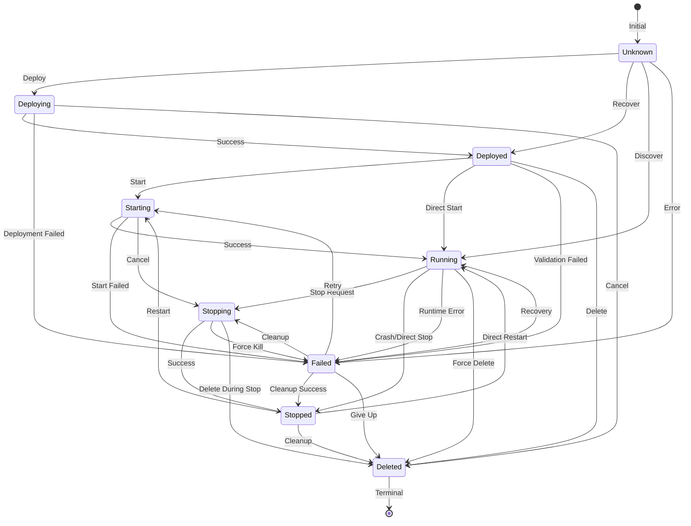

# Provider State Machine

## State Transition Diagram



## State Descriptions

### Unknown (0)
- **Initial/recovery state**
- Can transition to any state (allows recovery)
- Used when provider doesn't know current state

### Deploying
- **Deployment in progress**
- Creating configuration, allocating resources
- Can succeed (→ Deployed) or fail (→ Failed)

### Deployed
- **Successfully deployed, not started**
- Ready to start
- Configuration created, resources allocated

### Starting
- **Start operation in progress**
- Process launching, container starting
- Can succeed (→ Running) or fail (→ Failed)

### Running
- **Instance is operational**
- Process running, accepting requests
- Can be stopped or may fail

### Stopping
- **Stop operation in progress**
- Graceful shutdown in progress
- Waiting for process to exit

### Stopped
- **Cleanly stopped**
- Can be restarted
- Resources still allocated (not deleted)

### Failed
- **Operation failed or runtime error**
- Recoverable - can retry start
- Can transition to many states for recovery

### Deleted
- **Terminal state**
- All resources cleaned up
- No further transitions allowed

## Valid Operations by State

### Can START from:
- ✅ Deployed (first start)
- ✅ Stopped (restart)
- ✅ Failed (retry)
- ✅ Unknown (recovery)
- ❌ Running, Starting, Stopping, Deploying, Deleted

### Can STOP from:
- ✅ Running (normal stop)
- ✅ Starting (cancel start)
- ✅ Failed (cleanup)
- ✅ Unknown (recovery)
- ❌ Stopped, Stopping, Deployed, Deploying, Deleted

### Can DEPLOY to:
- ✅ New instance only
- ❌ Cannot redeploy existing instance (must delete first)

### Can DELETE from:
- ✅ Any state except Deleted
- Forces cleanup regardless of current state

## Usage in Providers

```csharp
// Validate operation is allowed
if (!ProviderStateMachine.CanStart(currentState))
{
    var reason = ProviderStateMachine.GetOperationBlockedReason("start", currentState);
    throw new InvalidOperationException($"Cannot start: {reason}");
}

// Validate specific transition
ProviderStateMachine.ValidateTransition(
    instanceId, 
    fromState, 
    toState, 
    "start"
);

// Get valid transitions
var validNextStates = ProviderStateMachine.GetValidTransitions(currentState);
```

## Error Messages

State machine provides clear, actionable error messages:

```
❌ "Cannot start instance 'xyz': Instance is already running."
❌ "Cannot start instance 'xyz': Instance is currently stopping. Wait for stop to complete."
❌ "Cannot stop instance 'xyz': Instance is not running. It was deployed but never started."
❌ "Cannot start instance 'xyz': Invalid state transition from 'Deleted' to 'Running'. 
    Valid transitions from 'Deleted' are: none (terminal state)"
```

## Extension Points

### Provider-Specific Overrides

If a provider needs different transition rules:

```csharp
public class KubernetesInstanceProvider : IPlatformInstanceProvider
{
    public Task<PlacementProviderRuntimeInfo> StartInstanceAsync(...)
    {
        // Can optionally add provider-specific validation
        if (state.Status == PlacementProviderRuntimeStatus.Deployed)
        {
            // K8s-specific check: verify namespace exists
            if (!await _k8sClient.NamespaceExists(namespace))
                throw new InvalidOperationException("Namespace not found");
        }

        // Then use common state machine
        ProviderStateMachine.ValidateTransition(...);
    }
}
```

### Adding New States

To add a new state (e.g., `Paused`):

1. Add to `PlacementProviderRuntimeStatus` enum
2. Update `ValidTransitions` dictionary in `ProviderStateMachine`
3. Update `CanStart()`, `CanStop()` if needed
4. Update `GetOperationBlockedReason()` with messages
5. Update this documentation

## Benefits

✅ **Consistency** - All providers use same transition logic  
✅ **Maintainability** - Single place to update transitions  
✅ **Testability** - Easy to unit test state machine  
✅ **Clarity** - Visualizable, self-documenting  
✅ **Extensibility** - Easy to add new states/transitions  
✅ **Error Messages** - Clear, actionable feedback  
