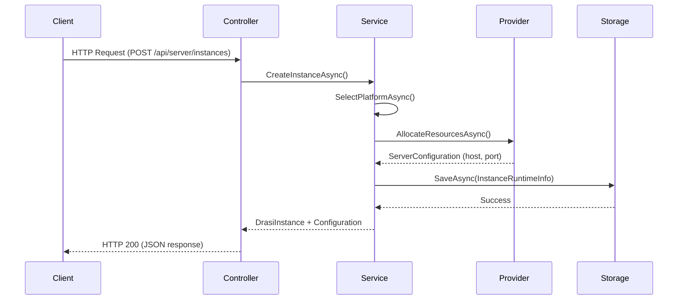

# DRaaS.ControlPlane

**REST API Frontend for DRaaS (Drasi as a Service)**

DRaaS.ControlPlane is a **Web API layer** that provides HTTP/REST endpoints for managing Drasi server instances. It acts as a **frontend interface** to the [DRaaS.Core](../DRaaS.Core) business logic library, exposing instance management, configuration, and monitoring capabilities through a RESTful API.

## Overview

This project serves as **one possible interface** to the DRaaS.Core library. While Core contains all the business logic for managing Drasi instances, ControlPlane provides a Web API wrapper that:

- Exposes REST endpoints for instance management
- Handles HTTP requests and responses
- Provides OpenAPI documentation via Scalar
- Manages dependency injection and application startup
- Receives status updates from external platform daemons

### Why Separate Projects?

The separation between **ControlPlane** (interface layer) and **Core** (business logic) enables:

✅ **Multiple Interfaces**: Console apps, desktop apps, Azure Functions, etc. can all use DRaaS.Core  
✅ **Technology Independence**: Core has no ASP.NET dependencies  
✅ **Reusability**: Core can be distributed as a NuGet package  
✅ **Testability**: Business logic can be tested independently  
✅ **Flexibility**: Swap Web API for gRPC, GraphQL, or other protocols

## Technology Stack

- **.NET 10.0** - ASP.NET Core Web API
- **DRaaS.Core** - Business logic library (project reference)
- **YamlDotNet 16.3.0** - YAML serialization for Drasi configurations
- **Microsoft.AspNetCore.JsonPatch** - RFC 6902 JSON Patch support
- **Newtonsoft.Json** - Required for JsonPatch integration
- **Scalar.AspNetCore** - Modern OpenAPI documentation UI

## Project Structure

```
DRaaS.ControlPlane/
├── Controllers/               # REST API endpoints
│   ├── ServerController.cs    # Instance management and operations
│   ├── ConfigurationController.cs  # Full configuration CRUD
│   └── StatusController.cs    # Status updates from external daemons
├── DTOs/                      # API-specific request/response models
│   └── CreateInstanceRequest.cs
├── Program.cs                 # Application startup and DI registration
└── Properties/
    └── launchSettings.json    # Development server configuration
```

### Responsibilities

**ControlPlane Contains**:
- REST API Controllers (HTTP endpoints)
- Request/Response DTOs (API models)
- Dependency Injection configuration
- Middleware pipeline setup
- OpenAPI/Scalar documentation

**ControlPlane Does NOT Contain**:
- Business logic (lives in DRaaS.Core)
- Domain models (lives in DRaaS.Core)
- Instance managers (lives in DRaaS.Core)
- Services (lives in DRaaS.Core)

## API Endpoints

### Instance Management (`/api/server`)

| Endpoint | Method | Description |
|----------|--------|-------------|
| `/api/server/instances` | POST | Create a new Drasi instance |
| `/api/server/instances/{id}` | GET | Get instance metadata |
| `/api/server/instances` | GET | List all instances |
| `/api/server/instances/{id}` | DELETE | Delete an instance |
| `/api/server/instances/{id}/status` | PUT | Update instance status |
| `/api/server/instances/{id}/server-configuration` | GET | Get server configuration |
| `/api/server/instances/{id}/server-configuration` | PATCH | Partially update server configuration |
| `/api/server/instances/{id}/start` | POST | Start an instance |
| `/api/server/instances/{id}/stop` | POST | Stop an instance |
| `/api/server/instances/{id}/restart` | POST | Restart an instance |
| `/api/server/instances/{id}/runtime-status` | GET | Get runtime status |
| `/api/server/platforms` | GET | Get available platforms and their status |

### Configuration Management (`/api/configuration`)

| Endpoint | Method | Description |
|----------|--------|-------------|
| `/api/configuration/instances/{id}` | GET | Get full configuration (sources, queries, reactions) |
| `/api/configuration/instances/{id}` | PATCH | Apply JSON Patch updates to configuration |

### Status Updates (`/api/status`)

| Endpoint | Method | Description |
|----------|--------|-------------|
| `/api/status/updates` | POST | Receive status update from external daemon |
| `/api/status/{instanceId}/status` | GET | Get last known status for an instance |
| `/api/status/recent-changes` | GET | Get recent status changes (for reconciliation polling) |

**New**: The `/api/status/recent-changes` endpoint supports API-driven reconciliation:

```bash
GET /api/status/recent-changes?since=2025-01-28T10:00:00Z&statusFilter=ConfigurationChanged
```

**Response**:
```json
[
  {
    "instanceId": "abc-123",
    "oldStatus": "Running",
    "newStatus": "ConfigurationChanged",
    "source": "ConfigurationController",
    "timestamp": "2025-01-28T14:35:22Z",
    "metadata": {}
  }
]
```

This endpoint enables:
- **Reconciliation polling**: DRaaS.Reconciliation polls for `ConfigurationChanged` events
- **Event buffering**: Last 1000 status changes maintained in memory
- **Filtered queries**: Query by timestamp and status type

## Request/Response Examples

### Create Instance

**Request**:
```http
POST /api/server/instances
Content-Type: application/json

{
  "name": "my-drasi-instance",
  "description": "Production analytics instance",
  "serverConfiguration": {
    "logLevel": "debug"
  }
}
```

**Response**:
```json
{
  "instance": {
    "id": "abc-123",
    "name": "my-drasi-instance",
    "description": "Production analytics instance",
    "platformType": "Process",
    "status": "Created",
    "createdAt": "2025-01-28T10:00:00Z"
  },
  "serverConfiguration": {
    "host": "127.0.0.1",
    "port": 8080,
    "logLevel": "debug"
  }
}
```

### Update Configuration (JSON Patch)

**Request**:
```http
PATCH /api/configuration/instances/abc-123
Content-Type: application/json-patch+json

[
  {
    "op": "add",
    "path": "/sources/-",
    "value": {
      "kind": "postgresql",
      "id": "my-db",
      "autoStart": true
    }
  }
]
```

**Response**: `200 OK` with updated configuration

### External Daemon Status Update

**Request** (from Docker/AKS daemon):
```http
POST /api/status/updates
Content-Type: application/json

{
  "instanceId": "abc-123",
  "status": "Running",
  "source": "DockerDaemon",
  "metadata": {
    "containerId": "d4f5e6",
    "imageName": "drasi-server:latest"
  }
}
```

**Response**: `202 Accepted`

## Dependency Injection

All services from **DRaaS.Core** are registered in `Program.cs`:

```csharp
// Core services
builder.Services.AddSingleton<IPortAllocator, PortAllocator>();
builder.Services.AddSingleton<IInstanceRuntimeStore, InMemoryInstanceRuntimeStore>();
builder.Services.AddSingleton<IDrasiInstanceService, DrasiInstanceService>();

// Platform managers
builder.Services.AddSingleton<IDrasiServerInstanceManager, ProcessInstanceManager>();
builder.Services.AddSingleton<IDrasiServerInstanceManager, DockerInstanceManager>();
builder.Services.AddSingleton<IDrasiServerInstanceManager, AksInstanceManager>();

// Orchestration
builder.Services.AddSingleton<IPlatformOrchestratorService, PlatformOrchestratorService>();

// Monitoring
builder.Services.AddSingleton<IStatusUpdateService, StatusUpdateService>();
builder.Services.AddSingleton<IStatusMonitor, ProcessStatusMonitor>();
```

Controllers inject these services via constructor injection.

## Running the Application

### Development Mode

```bash
cd src/DRaaS.ControlPlane
dotnet run
```

**Console Output**:
- Use **Ctrl+F5** to see console telemetry
- Or check **Output window** → "ASP.NET Core Web Server" pane in Visual Studio

**API Documentation**:
- Swagger UI: `http://localhost:5000/swagger`
- Scalar UI: `http://localhost:5000/scalar/v1` (recommended)

### Production Mode

```bash
dotnet publish -c Release
cd bin/Release/net10.0/publish
dotnet DRaaS.ControlPlane.dll
```

## Configuration

### Launch Settings (`launchSettings.json`)

Configures development server ports and URLs:

```json
{
  "profiles": {
    "http": {
      "commandName": "Project",
      "launchBrowser": true,
      "applicationUrl": "http://localhost:5000",
      "environmentVariables": {
        "ASPNETCORE_ENVIRONMENT": "Development"
      }
    }
  }
}
```

### Application Settings (`appsettings.json`)

#### ProcessInstanceManager Configuration

Configure how local process instances are launched:

```json
{
  "ProcessInstanceManager": {
    "ExecutablePath": "drasi-server",
    "InstanceConfigDirectory": "./drasi-configs",
    "DefaultLogLevel": "info",
    "ShutdownTimeoutSeconds": 5,
    "WorkingDirectory": "./drasi-runtime"
  }
}
```

**Configuration Options**:

| Property | Type | Default | Description |
|----------|------|---------|-------------|
| `ExecutablePath` | string | `"drasi-server"` | Path to drasi-server executable (absolute, relative, or in PATH) |
| `InstanceConfigDirectory` | string | `"./drasi-configs"` | Directory for instance-specific YAML configs |
| `DefaultLogLevel` | string | `"info"` | Default log level (trace, debug, info, warn, error) |
| `ShutdownTimeoutSeconds` | int | `5` | Graceful shutdown timeout before force kill |
| `WorkingDirectory` | string | `"./drasi-runtime"` | Working directory for drasi-server processes |

When creating instances with `platformType: "Process"`, the system:

1. Generates a YAML config file at `{InstanceConfigDirectory}/{instanceId}-config.yaml`
2. Launches drasi-server: `drasi-server --config {configFile}`
3. Tracks the process with PID
4. Monitors health and publishes status changes

**Example Generated YAML**:
```yaml
id: my-instance
host: 127.0.0.1
port: 8080
logLevel: info
persistConfig: true
persistIndex: false

sources:
  - kind: mock
    id: test-source
    autoStart: true

queries:
  - id: my-query
    query: |
      MATCH (n) RETURN n
    sources:
      - sourceId: test-source

reactions:
  - kind: log
    id: log-output
    queries: [my-query]
```

See [ProcessInstanceManager Documentation](../DRaaS.Core/Providers/InstanceManagers/ProcessInstanceManager-README.md) for detailed configuration guide.

### Future Configuration Options

Planned application settings:

- Default platform type (Process, Docker, AKS)
- Port allocation range (currently 8080-9000)
- Polling interval for process monitoring (currently 5s)
- Storage backend (in-memory, Cosmos, SQL, Redis)

## DTOs (Data Transfer Objects)

API-specific models that differ from domain models:

### `CreateInstanceRequest`

```csharp
public record CreateInstanceRequest
{
    public string Name { get; init; } = string.Empty;
    public string? Description { get; init; }
    public ServerConfiguration? ServerConfiguration { get; init; }
}
```

**Design Decision**: Users only specify name, description, and optional log level. Host, port, and platform type are managed automatically by the orchestrator.

## Architecture Flow



**Example**: Creating an instance

1. `POST /api/server/instances` → `ServerController`
2. `ServerController` → `IDrasiInstanceService.CreateInstanceAsync()`
3. `DrasiInstanceService` → `IPlatformOrchestratorService.SelectPlatformAsync()`
4. `PlatformOrchestratorService` → `IInstanceManagerFactory.GetManager()`
5. `ProcessInstanceManager` → `IPortAllocator.AllocatePort()`
6. `DrasiInstanceService` → `IInstanceRuntimeStore.SaveAsync()`
7. Return instance metadata and configuration to controller
8. Controller returns HTTP 200 with JSON response

## Monitoring Integration

### Polling-Based (Process)

ControlPlane automatically starts the `ProcessStatusMonitor` on application startup:

```csharp
var statusMonitor = app.Services.GetRequiredService<IStatusMonitor>();
if (statusMonitor.RequiresPolling)
{
    _ = statusMonitor.StartMonitoringAsync(lifetime.ApplicationStopping);
}
```

The monitor checks local processes every 5 seconds and publishes status changes to `IStatusUpdateService`.

### Push-Based (Docker/AKS)

External daemons POST status updates to `/api/status/updates`:

```
Docker/AKS Daemon
    ↓ (detects container/pod status change)
POST /api/status/updates
    ↓
StatusController
    ↓
IStatusUpdateService.PublishStatusUpdateAsync()
    ↓
StatusChanged event raised
    ↓
Subscribers notified
```

See [DRaaS.Core/DISTRIBUTED_MONITORING.md](../DRaaS.Core/DISTRIBUTED_MONITORING.md) for daemon implementation details.

## OpenAPI Documentation

When running in development mode, ControlPlane provides interactive API documentation:

### Scalar (Recommended)

Modern, developer-friendly UI with:
- Interactive request/response examples
- Code generation for multiple languages
- Dark mode support

**URL**: `http://localhost:5000/scalar/v1`

### Swagger UI (Default)

Traditional Swagger UI:

**URL**: `http://localhost:5000/swagger`

## Authentication & Authorization

⚠️ **Not yet implemented**

Planned features:
- JWT bearer token authentication
- Role-based access control (RBAC)
- API key support for daemon authentication
- mTLS for daemon-to-ControlPlane communication

## Error Handling

Controllers return standard HTTP status codes:

| Status Code | Scenario |
|-------------|----------|
| `200 OK` | Successful operation |
| `202 Accepted` | Async operation accepted (status updates) |
| `400 Bad Request` | Invalid request data |
| `404 Not Found` | Instance not found |
| `500 Internal Server Error` | Unexpected error |

## Extending ControlPlane

### Adding a New Endpoint

1. Create a new controller in `Controllers/`
2. Inject required Core services via constructor
3. Implement endpoint methods
4. Return appropriate DTOs
5. Document with XML comments for OpenAPI

**Example**:

```csharp
[ApiController]
[Route("api/[controller]")]
public class HealthController : ControllerBase
{
    private readonly IDrasiInstanceService _instanceService;

    public HealthController(IDrasiInstanceService instanceService)
    {
        _instanceService = instanceService;
    }

    /// <summary>
    /// Gets health status of all instances
    /// </summary>
    [HttpGet]
    public async Task<IActionResult> GetHealth()
    {
        var instances = await _instanceService.GetAllInstancesAsync();
        return Ok(new { totalInstances = instances.Count() });
    }
}
```

### Adding a New DTO

1. Create a record in `DTOs/`
2. Keep it focused on API needs (not domain logic)
3. Use init-only properties for immutability

**Example**:

```csharp
namespace DRaaS.ControlPlane.DTOs;

public record UpdateInstanceRequest
{
    public string? Name { get; init; }
    public string? Description { get; init; }
}
```

## Relationship to DRaaS.Core

**ControlPlane** is **one of many possible interfaces** to **Core**.

Other potential interfaces:
- **Console Application**: CLI tool for scripting and automation
- **Desktop Application**: WPF/MAUI GUI for visual management
- **Azure Function**: Serverless event-driven management
- **gRPC Service**: High-performance binary protocol
- **GraphQL API**: Flexible query-driven interface

All these interfaces would:
1. Reference **DRaaS.Core** project
2. Inject Core services
3. Call Core methods
4. Present results in their specific format

## Development Guidelines

### Do's ✅
- Keep controllers thin (delegate to Core services)
- Use DTOs for API-specific models
- Document endpoints with XML comments
- Return appropriate HTTP status codes
- Validate input at controller level

### Don'ts ❌
- Don't put business logic in controllers
- Don't reference domain models directly in API responses
- Don't bypass Core services
- Don't manage state in controllers
- Don't implement storage logic in ControlPlane

## Testing

### Unit Testing Controllers

Mock Core services to test controller behavior:

```csharp
[Fact]
public async Task CreateInstance_ReturnsOk()
{
    // Arrange
    var mockService = new Mock<IDrasiInstanceService>();
    mockService.Setup(s => s.CreateInstanceAsync(It.IsAny<string>(), It.IsAny<string>(), null))
        .ReturnsAsync(new DrasiInstance { Id = "test-123", Name = "test" });
    
    var controller = new ServerController(mockService.Object, ...);
    
    // Act
    var result = await controller.CreateInstance(new CreateInstanceRequest { Name = "test" });
    
    // Assert
    Assert.IsType<OkObjectResult>(result);
}
```

### Integration Testing

Use `WebApplicationFactory` to test full HTTP pipeline:

```csharp
public class ServerControllerIntegrationTests : IClassFixture<WebApplicationFactory<Program>>
{
    private readonly HttpClient _client;

    public ServerControllerIntegrationTests(WebApplicationFactory<Program> factory)
    {
        _client = factory.CreateClient();
    }

    [Fact]
    public async Task GetInstances_ReturnsOk()
    {
        var response = await _client.GetAsync("/api/server/instances");
        response.EnsureSuccessStatusCode();
    }
}
```

## Future Enhancements

Planned features for ControlPlane:

1. **Authentication Middleware**: JWT bearer tokens, API keys
2. **Rate Limiting**: Prevent API abuse
3. **Request Validation**: FluentValidation for DTOs
4. **Error Middleware**: Global exception handling
5. **Logging Middleware**: Structured logging with Serilog
6. **CORS Configuration**: Cross-origin request support
7. **Health Checks**: `/health` endpoint for monitoring
8. **Metrics**: Prometheus endpoint for observability
9. **SignalR Hub**: Real-time status updates to UI clients
10. **Webhooks**: Notify external systems of status changes

## Related Documentation

- **[DRaaS.Core README](../DRaaS.Core/README.md)** - Business logic library architecture
- **[DRaaS.Core Services](../DRaaS.Core/Services/README.md)** - Service layer organization
- **[Distributed Monitoring](../DRaaS.Core/DISTRIBUTED_MONITORING.md)** - Status monitoring architecture

## Support

For issues, questions, or contributions, please see the main repository README.

---

**Remember**: ControlPlane is just the **interface layer**. All the real work happens in **DRaaS.Core**! 🚀
