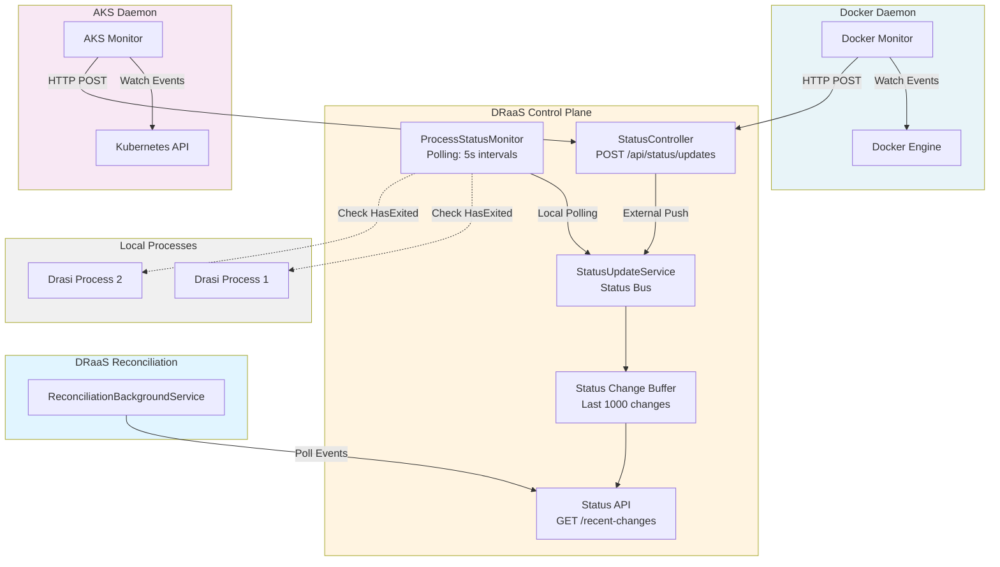

# Distributed Platform Monitoring Architecture

## Overview

DRaaS supports **bidirectional status management** with two distinct patterns:

1. **Local Polling (Process)**: Control plane actively polls process status
2. **Push-Based (Docker/AKS)**: External daemons push status updates to control plane API

## Architecture Diagram



**Status Flow**:
1. **Local Processes**: `ProcessStatusMonitor` polls every 5s → `StatusUpdateService`
2. **Docker Containers**: Docker daemon watches events → POST `/api/status/updates` → `StatusController` → `StatusUpdateService`
3. **AKS Pods**: AKS daemon watches K8s events → POST `/api/status/updates` → `StatusController` → `StatusUpdateService`
4. **Status Buffer**: `StatusUpdateService` maintains rolling buffer of last 1000 changes
5. **Reconciliation**: Polls GET `/api/status/recent-changes` for configuration changes

## Process Monitoring (Polling)

**Implementation**: `ProcessStatusMonitor`

The control plane directly monitors local processes:

```csharp
// Runs in background task
while (!cancellationToken.IsCancellationRequested)
{
    foreach (var instance in processInstances)
    {
        if (process.HasExited)
        {
            await _statusUpdateService.PublishStatusUpdateAsync(
                instanceId, 
                InstanceStatus.Stopped, 
                "ProcessMonitor");
        }
    }
    await Task.Delay(TimeSpan.FromSeconds(5));
}
```

**Advantages**:
- Direct access to process objects
- Immediate detection of crashes
- No external dependencies

**Limitations**:
- Only works for local processes
- Polling overhead (mitigated by 5s intervals)
- State lost on control plane restart

## Docker Daemon (Push-Based)

**Location**: Separate daemon service (to be implemented)

**Responsibilities**:
1. Subscribe to Docker events API
2. Filter events for DRaaS-managed containers
3. Push status updates to control plane

### Docker Daemon Implementation Example

```bash
# Docker daemon runs separately from control plane
docker events --filter 'label=draas.managed=true' --format '{{json .}}'
```

```csharp
// Daemon implementation (separate service)
public class DockerDaemon
{
    private readonly HttpClient _controlPlaneClient;
    private readonly string _controlPlaneUrl;

    public async Task MonitorDockerEventsAsync()
    {
        // Subscribe to Docker events
        using var eventStream = await _dockerClient.System.MonitorEventsAsync(
            new ContainerEventsParameters
            {
                Filters = new Dictionary<string, IDictionary<string, bool>>
                {
                    ["label"] = new Dictionary<string, bool> 
                    { 
                        ["draas.managed=true"] = true 
                    }
                }
            });

        await foreach (var message in eventStream)
        {
            var status = MapDockerEventToStatus(message.Status);
            var instanceId = message.Actor.Attributes["draas.instanceId"];

            // Push to control plane
            await _controlPlaneClient.PostAsJsonAsync(
                $"{_controlPlaneUrl}/api/status/updates",
                new StatusUpdateRequest
                {
                    InstanceId = instanceId,
                    Status = status,
                    Source = "DockerDaemon",
                    Metadata = new Dictionary<string, string>
                    {
                        ["ContainerId"] = message.Actor.ID,
                        ["ImageName"] = message.Actor.Attributes["image"],
                        ["EventAction"] = message.Action
                    }
                });
        }
    }
}
```

### Control Plane API Endpoint

```http
POST /api/status/updates
Content-Type: application/json

{
  "instanceId": "abc-123",
  "status": "Running",
  "source": "DockerDaemon",
  "metadata": {
    "containerId": "d4f5e6",
    "imageName": "drasi-server:latest"
  }
}
```

**Response**: `202 Accepted`

## AKS Daemon (Push-Based)

**Location**: Deployed as Kubernetes DaemonSet or Deployment

**Responsibilities**:
1. Watch Kubernetes pod events via client-go or KubernetesClient
2. Filter for DRaaS-managed pods (by label)
3. Push status updates to control plane

### AKS Daemon Implementation Example

```csharp
// Daemon runs inside Kubernetes cluster
public class AksDaemon
{
    private readonly Kubernetes _k8sClient;
    private readonly HttpClient _controlPlaneClient;

    public async Task MonitorK8sPodsAsync()
    {
        // Watch pods with DRaaS label
        var watcher = _k8sClient.CoreV1.ListNamespacedPodWithHttpMessagesAsync(
            namespaceParameter: "drasi-instances",
            labelSelector: "app=drasi,managed-by=draas",
            watch: true);

        await foreach (var (type, pod) in watcher.WatchAsync<V1Pod>())
        {
            var status = MapPodPhaseToStatus(pod.Status.Phase);
            var instanceId = pod.Metadata.Labels["draas.instanceId"];

            // Push to control plane
            await _controlPlaneClient.PostAsJsonAsync(
                $"{_controlPlaneUrl}/api/status/updates",
                new StatusUpdateRequest
                {
                    InstanceId = instanceId,
                    Status = status,
                    Source = "AKSDaemon",
                    Metadata = new Dictionary<string, string>
                    {
                        ["PodName"] = pod.Metadata.Name,
                        ["Namespace"] = pod.Metadata.NamespaceProperty,
                        ["NodeName"] = pod.Spec.NodeName,
                        ["Phase"] = pod.Status.Phase,
                        ["PodIP"] = pod.Status.PodIP
                    }
                });
        }
    }
}
```

### Kubernetes Deployment

```yaml
apiVersion: apps/v1
kind: Deployment
metadata:
  name: draas-aks-daemon
  namespace: draas-system
spec:
  replicas: 1
  selector:
    matchLabels:
      app: draas-aks-daemon
  template:
    metadata:
      labels:
        app: draas-aks-daemon
    spec:
      serviceAccountName: draas-monitor
      containers:
      - name: daemon
        image: draas-aks-daemon:latest
        env:
        - name: CONTROL_PLANE_URL
          value: "https://draas-control-plane.example.com"
        - name: WATCH_NAMESPACE
          value: "drasi-instances"
---
apiVersion: v1
kind: ServiceAccount
metadata:
  name: draas-monitor
  namespace: draas-system
---
apiVersion: rbac.authorization.k8s.io/v1
kind: ClusterRole
metadata:
  name: draas-monitor
rules:
- apiGroups: [""]
  resources: ["pods"]
  verbs: ["get", "list", "watch"]
---
apiVersion: rbac.authorization.k8s.io/v1
kind: ClusterRoleBinding
metadata:
  name: draas-monitor
roleRef:
  apiGroup: rbac.authorization.k8s.io
  kind: ClusterRole
  name: draas-monitor
subjects:
- kind: ServiceAccount
  name: draas-monitor
  namespace: draas-system
```

## Status Flow

### Process (Polling)
```
Process crashes
    ↓
ProcessMonitor detects (next poll cycle ~5s)
    ↓
statusUpdateService.PublishStatusUpdateAsync()
    ↓
StatusChanged event raised
    ↓
Runtime store updated
```

### Docker/AKS (Push)
```
Container/Pod status changes
    ↓
Docker/K8s event emitted
    ↓
External daemon receives event
    ↓
POST /api/status/updates
    ↓
StatusController receives request
    ↓
statusUpdateService.PublishStatusUpdateAsync()
    ↓
StatusChanged event raised
    ↓
Runtime store updated
```

## Event Subscription

Applications can subscribe to status changes:

```csharp
public class StatusNotificationService
{
    public StatusNotificationService(IStatusUpdateService statusUpdateService)
    {
        statusUpdateService.StatusChanged += OnStatusChanged;
    }

    private void OnStatusChanged(object? sender, StatusUpdateEventArgs e)
    {
        Console.WriteLine($"Instance {e.InstanceId}: {e.OldStatus} → {e.NewStatus}");
        Console.WriteLine($"Source: {e.Source} at {e.Timestamp}");
        
        // Can trigger:
        // - Logging
        // - Notifications (email, Slack, Teams)
        // - Auto-restart policies
        // - Metrics collection
        // - UI updates via SignalR
    }
}
```

## Daemon Configuration

Both daemons require:

1. **Control Plane URL**: Where to push updates
2. **Authentication**: API key or certificate for StatusController
3. **Label Filters**: Which containers/pods to monitor
4. **Retry Policy**: Handle network failures gracefully

## Security Considerations

### StatusController Authentication

```csharp
[Authorize(Policy = "DaemonPolicy")]
[HttpPost("updates")]
public async Task<IActionResult> ReceiveStatusUpdate([FromBody] StatusUpdateRequest request)
{
    // Verify request is from authorized daemon
}
```

### Recommended Approach

1. **Mutual TLS**: Daemons use client certificates
2. **API Keys**: Include in request headers
3. **IP Allowlisting**: Restrict StatusController to known daemon IPs
4. **Rate Limiting**: Prevent flooding from rogue daemons

## Benefits of This Architecture

| Aspect | Process (Polling) | Docker/AKS (Push) |
|--------|------------------|-------------------|
| **Latency** | 5s average | Near real-time (~100ms) |
| **Network Overhead** | None | Minimal (event-driven) |
| **Scalability** | Limited to local machine | Scales to 1000s of instances |
| **State Persistence** | Lost on restart | Daemon can resync on startup |
| **Deployment** | Built-in | Requires daemon deployment |

## Future Enhancements

1. **Status Webhooks**: Allow users to subscribe to status changes
2. **SignalR Hub**: Real-time UI updates
3. **Auto-Restart Policies**: Automatically restart failed instances
4. **Health Probes**: Daemons can call health endpoints
5. **Distributed Tracing**: Correlate status updates across systems
