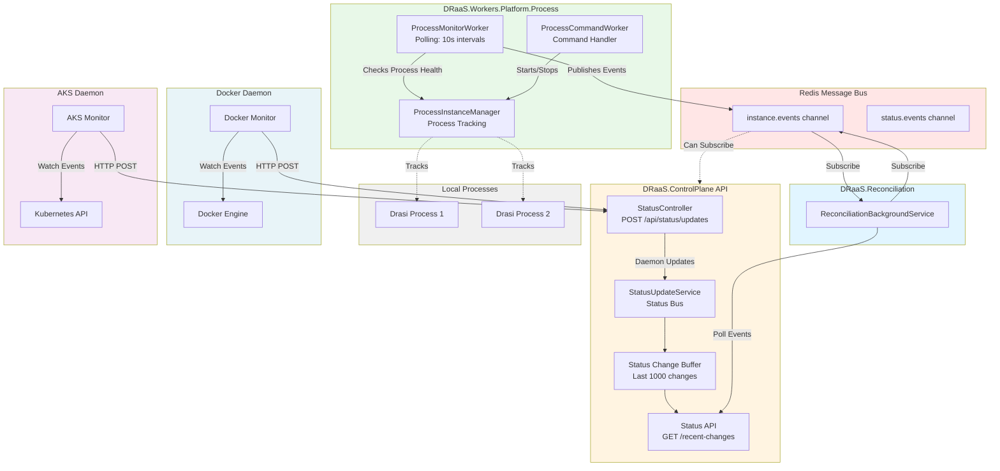

# Distributed Platform Monitoring Architecture

## Overview

DRaaS supports monitoring across multiple deployment patterns:

1. **Worker-Based (Process)**: Dedicated worker service monitors local processes and publishes events via message bus
2. **Daemon-Based (Docker/AKS)**: External daemons monitor containers/pods and POST updates to ControlPlane API

The system uses both message bus communication (for distributed workers) and HTTP API communication (for external daemons) to provide flexible monitoring across different platforms.

## Architecture Diagram



**Status Flow**:
1. **Local Processes**: ProcessMonitorWorker polls every 10s → publishes InstanceStatusChangedEvent to `instance.events`
2. **Docker Containers**: Docker daemon watches events → POST `/api/status/updates` → StatusController → StatusUpdateService
3. **AKS Pods**: AKS daemon watches K8s events → POST `/api/status/updates` → StatusController → StatusUpdateService
4. **Status Buffer**: StatusUpdateService maintains rolling buffer of last 1000 changes
5. **Reconciliation**: Can subscribe to `instance.events` for real-time updates AND/OR poll GET `/api/status/recent-changes`

## Process Monitoring (Worker-Based)

**Implementation**: DRaaS.Workers.Platform.Process service

The Process platform uses a dedicated worker service that runs separately from the ControlPlane API. This worker monitors local processes and communicates via Redis message bus.

### ProcessMonitorWorker

Runs as a BackgroundService that continuously monitors process health:

```csharp
// Worker implementation
protected override async Task ExecuteAsync(CancellationToken stoppingToken)
{
    while (!stoppingToken.IsCancellationRequested)
    {
        foreach (var (instanceId, process) in _instanceManager.TrackedProcesses)
        {
            if (process.HasExited)
            {
                // Update runtime store
                var updatedInfo = runtimeInfo with
                {
                    Status = InstanceStatus.Error,
                    StoppedAt = DateTime.UtcNow
                };
                await _runtimeStore.SaveAsync(updatedInfo);

                // Publish status change event to message bus
                await _messageBus.PublishAsync(
                    Channels.InstanceEvents,
                    new InstanceStatusChangedEvent
                    {
                        InstanceId = instanceId,
                        OldStatus = InstanceStatus.Running,
                        NewStatus = InstanceStatus.Error,
                        Source = "ProcessMonitorWorker"
                    });
            }
        }
        await Task.Delay(TimeSpan.FromSeconds(10), stoppingToken);
    }
}
```

**Advantages**:
- Decoupled from ControlPlane API (runs as separate process)
- Direct access to process objects via ProcessInstanceManager
- Can scale independently (run on different machine if needed)
- Uses message bus for event notifications
- Resilient to ControlPlane restarts

**Configuration**:
- Polling interval: 10 seconds (configurable)
- Publishes to: `instance.events` channel
- Requires: Redis connection, IInstanceRuntimeStore access

## Docker Daemon (Push-Based)

**Location**: Separate daemon service (to be implemented)

**Responsibilities**:
1. Subscribe to Docker events API
2. Filter events for DRaaS-managed containers
3. Push status updates to control plane

### Docker Daemon Implementation Example

```bash
# Docker daemon runs separately from control plane
docker events --filter 'label=draas.managed=true' --format '{{json .}}'
```

```csharp
// Daemon implementation (separate service)
public class DockerDaemon
{
    private readonly HttpClient _controlPlaneClient;
    private readonly string _controlPlaneUrl;

    public async Task MonitorDockerEventsAsync()
    {
        // Subscribe to Docker events
        using var eventStream = await _dockerClient.System.MonitorEventsAsync(
            new ContainerEventsParameters
            {
                Filters = new Dictionary<string, IDictionary<string, bool>>
                {
                    ["label"] = new Dictionary<string, bool> 
                    { 
                        ["draas.managed=true"] = true 
                    }
                }
            });

        await foreach (var message in eventStream)
        {
            var status = MapDockerEventToStatus(message.Status);
            var instanceId = message.Actor.Attributes["draas.instanceId"];

            // Push to control plane
            await _controlPlaneClient.PostAsJsonAsync(
                $"{_controlPlaneUrl}/api/status/updates",
                new StatusUpdateRequest
                {
                    InstanceId = instanceId,
                    Status = status,
                    Source = "DockerDaemon",
                    Metadata = new Dictionary<string, string>
                    {
                        ["ContainerId"] = message.Actor.ID,
                        ["ImageName"] = message.Actor.Attributes["image"],
                        ["EventAction"] = message.Action
                    }
                });
        }
    }
}
```

### Control Plane API Endpoint

```http
POST /api/status/updates
Content-Type: application/json

{
  "instanceId": "abc-123",
  "status": "Running",
  "source": "DockerDaemon",
  "metadata": {
    "containerId": "d4f5e6",
    "imageName": "drasi-server:latest"
  }
}
```

**Response**: `202 Accepted`

## AKS Daemon (Push-Based)

**Location**: Deployed as Kubernetes DaemonSet or Deployment

**Responsibilities**:
1. Watch Kubernetes pod events via client-go or KubernetesClient
2. Filter for DRaaS-managed pods (by label)
3. Push status updates to control plane

### AKS Daemon Implementation Example

```csharp
// Daemon runs inside Kubernetes cluster
public class AksDaemon
{
    private readonly Kubernetes _k8sClient;
    private readonly HttpClient _controlPlaneClient;

    public async Task MonitorK8sPodsAsync()
    {
        // Watch pods with DRaaS label
        var watcher = _k8sClient.CoreV1.ListNamespacedPodWithHttpMessagesAsync(
            namespaceParameter: "drasi-instances",
            labelSelector: "app=drasi,managed-by=draas",
            watch: true);

        await foreach (var (type, pod) in watcher.WatchAsync<V1Pod>())
        {
            var status = MapPodPhaseToStatus(pod.Status.Phase);
            var instanceId = pod.Metadata.Labels["draas.instanceId"];

            // Push to control plane
            await _controlPlaneClient.PostAsJsonAsync(
                $"{_controlPlaneUrl}/api/status/updates",
                new StatusUpdateRequest
                {
                    InstanceId = instanceId,
                    Status = status,
                    Source = "AKSDaemon",
                    Metadata = new Dictionary<string, string>
                    {
                        ["PodName"] = pod.Metadata.Name,
                        ["Namespace"] = pod.Metadata.NamespaceProperty,
                        ["NodeName"] = pod.Spec.NodeName,
                        ["Phase"] = pod.Status.Phase,
                        ["PodIP"] = pod.Status.PodIP
                    }
                });
        }
    }
}
```

### Kubernetes Deployment

```yaml
apiVersion: apps/v1
kind: Deployment
metadata:
  name: draas-aks-daemon
  namespace: draas-system
spec:
  replicas: 1
  selector:
    matchLabels:
      app: draas-aks-daemon
  template:
    metadata:
      labels:
        app: draas-aks-daemon
    spec:
      serviceAccountName: draas-monitor
      containers:
      - name: daemon
        image: draas-aks-daemon:latest
        env:
        - name: CONTROL_PLANE_URL
          value: "https://draas-control-plane.example.com"
        - name: WATCH_NAMESPACE
          value: "drasi-instances"
---
apiVersion: v1
kind: ServiceAccount
metadata:
  name: draas-monitor
  namespace: draas-system
---
apiVersion: rbac.authorization.k8s.io/v1
kind: ClusterRole
metadata:
  name: draas-monitor
rules:
- apiGroups: [""]
  resources: ["pods"]
  verbs: ["get", "list", "watch"]
---
apiVersion: rbac.authorization.k8s.io/v1
kind: ClusterRoleBinding
metadata:
  name: draas-monitor
roleRef:
  apiGroup: rbac.authorization.k8s.io
  kind: ClusterRole
  name: draas-monitor
subjects:
- kind: ServiceAccount
  name: draas-monitor
  namespace: draas-system
```

## Status Flow

### Process (Worker-Based)
```
Process crashes or exits
    ↓
ProcessMonitorWorker detects (next poll cycle ~10s)
    ↓
Update IInstanceRuntimeStore
    ↓
Publish InstanceStatusChangedEvent to instance.events channel
    ↓
Redis Message Bus
    ↓
Subscribers receive event:
    - Reconciliation service (for auto-recovery)
    - Logging service (for audit trails)
    - Monitoring dashboard (for real-time updates)
    - Other interested services
```

### Docker/AKS (Daemon-Based)
```
Container/Pod status changes
    ↓
Docker/K8s event emitted
    ↓
External daemon receives event
    ↓
POST /api/status/updates (HTTP)
    ↓
StatusController receives request
    ↓
statusUpdateService.PublishStatusUpdateAsync()
    ↓
StatusChanged event raised (in-process)
    ↓
Runtime store updated
    ↓
Status buffer updated (for polling reconciliation)
```

**Key Differences**:
- Process platform uses message bus for event distribution (pub/sub via Redis)
- Docker/AKS platforms use HTTP API for status updates (request/response)
- Process events can be subscribed to by multiple services via Redis channels
- Docker/AKS updates flow through ControlPlane StatusController centrally

## Event Subscription

### Message Bus Subscription (Process Platform)

Services can subscribe to events via the message bus:

```csharp
public class StatusNotificationService : BackgroundService
{
    private readonly IMessageBus _messageBus;

    public StatusNotificationService(IMessageBus messageBus)
    {
        _messageBus = messageBus;
    }

    protected override async Task ExecuteAsync(CancellationToken stoppingToken)
    {
        await _messageBus.SubscribeAsync<InstanceStatusChangedEvent>(
            Channels.InstanceEvents,
            async (evt) =>
            {
                Console.WriteLine($"Instance {evt.InstanceId}: {evt.OldStatus} → {evt.NewStatus}");
                Console.WriteLine($"Source: {evt.Source}");

                // Can trigger:
                // - Logging to external systems
                // - Notifications (email, Slack, Teams)
                // - Auto-restart policies
                // - Metrics collection
                // - Alert generation
                // - UI updates via SignalR
            },
            stoppingToken);
    }
}
```

### In-Process Subscription (ControlPlane)

For services running within the ControlPlane process:

```csharp
public class InProcessStatusNotifier
{
    public InProcessStatusNotifier(IStatusUpdateService statusUpdateService)
    {
        statusUpdateService.StatusChanged += OnStatusChanged;
    }

    private void OnStatusChanged(object? sender, StatusUpdateEventArgs e)
    {
        Console.WriteLine($"Instance {e.InstanceId}: {e.OldStatus} → {e.NewStatus}");
        Console.WriteLine($"Source: {e.Source} at {e.Timestamp}");
    }
}
```

## Daemon Configuration

Docker and AKS daemons require:

1. **Control Plane URL**: Where to push status updates
2. **Authentication**: API key or certificate for StatusController
3. **Label Filters**: Which containers/pods to monitor
4. **Retry Policy**: Handle network failures gracefully

For Process platform workers:

1. **Redis Connection**: Connection string for message bus
2. **Polling Interval**: How often to check process health (default: 10s)
3. **Runtime Store**: Shared state for instance information

## Security Considerations

### StatusController Authentication

```csharp
[Authorize(Policy = "DaemonPolicy")]
[HttpPost("updates")]
public async Task<IActionResult> ReceiveStatusUpdate([FromBody] StatusUpdateRequest request)
{
    // Verify request is from authorized daemon
}
```

### Recommended Approach

1. **Mutual TLS**: Daemons use client certificates
2. **API Keys**: Include in request headers
3. **IP Allowlisting**: Restrict StatusController to known daemon IPs
4. **Rate Limiting**: Prevent flooding from rogue daemons

## Monitoring Architecture Comparison

| Aspect | Process (Worker-Based) | Docker/AKS (Daemon-Based) |
|--------|----------------------|---------------------------|
| **Communication** | Redis Pub/Sub (message bus) | HTTP API (request/response) |
| **Latency** | 10s polling interval | Near real-time (~100ms) |
| **Network Overhead** | Redis messaging | HTTP requests |
| **Scalability** | Distributed workers per machine | Scales to 1000s of instances |
| **Event Distribution** | Pub/sub to multiple subscribers | Centralized through API |
| **Deployment** | Worker service per host | Daemon deployment required |
| **Coordination** | Via shared RuntimeStore | Via API calls |

## Future Enhancements

1. **Status Webhooks**: Allow users to subscribe to status changes via HTTP callbacks
2. **SignalR Hub**: Real-time UI updates for browser-based dashboards
3. **Auto-Restart Policies**: Automatically restart failed instances with configurable strategies
4. **Health Probes**: Daemons can call HTTP health endpoints beyond process checks
5. **Distributed Tracing**: Correlate status updates across systems with trace IDs
6. **Unified Message Bus**: Migrate Docker/AKS daemons to use message bus instead of HTTP API
7. **Dead Letter Queue**: Handle failed event processing with retry and dead letter queues
8. **Event Replay**: Replay historical events for debugging and recovery scenarios
