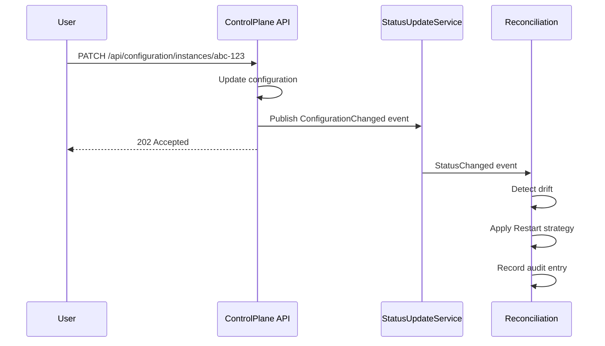

# DRaaS.Reconciliation

**API-Driven Desired State Reconciliation Daemon for DRaaS**

DRaaS.Reconciliation is a **standalone daemon service** that implements configuration drift detection and reconciliation for Drasi instances. It ensures that running instances always match their desired configuration state by detecting drift and applying corrective actions **through the ControlPlane REST API**.

## Overview

This service implements the **desired state reconciliation pattern** (similar to Kubernetes operators) where:

1. **Desired State** is retrieved from ControlPlane API (`GET /api/configuration/instances/{id}`)
2. **Actual State** is tracked locally for running instances
3. **Drift Detection** compares desired vs actual
4. **Reconciliation** applies changes via ControlPlane API (`POST /api/servers/instances/{id}/stop`, `POST /api/servers/instances/{id}/start`)

## Architecture

### API-Driven Architecture (Current)

All operations flow through the ControlPlane REST API, ensuring:
- ✅ **Single Source of Truth**: ControlPlane is the only management path
- ✅ **RBAC Enforcement**: All operations subject to API-level access control
- ✅ **Centralized Audit**: All actions logged through ControlPlane
- ✅ **Consistency**: No duplicate service registrations or state conflicts

```
┌──────────────────────────────────────────────────────────────┐
│           DRaaS.Reconciliation (Daemon Service)              │
│                                                              │
│  ┌────────────────────────────────────────────────────────┐ │
│  │   ReconciliationBackgroundService                      │ │
│  │   ├─ Periodic Loop (every 30s)                         │ │
│  │   └─ Event-Driven (on ConfigurationChanged)           │ │
│  └──────────────┬─────────────────────────────────────────┘ │
│                 │                                            │
│  ┌──────────────▼─────────────────────────────────────────┐ │
│  │   ReconciliationService                                │ │
│  │   ├─ Detect Drift                                      │ │
│  │   ├─ Select Strategy                                   │ │
│  │   ├─ Apply Changes (via API)                          │ │
│  │   └─ Record Audit                                      │ │
│  └──────────────┬─────────────────────────────────────────┘ │
│                 │                                            │
│  ┌──────────────▼─────────────────────────────────────────┐ │
│  │   Strategies                                           │ │
│  │   ├─ RestartReconciliationStrategy (uses API client)  │ │
│  │   ├─ RollingUpdateStrategy (future)                   │ │
│  │   ├─ BlueGreenStrategy (future)                       │ │
│  │   └─ CanaryStrategy (future)                          │ │
│  └──────────────┬─────────────────────────────────────────┘ │
│                 │                                            │
│  ┌──────────────▼─────────────────────────────────────────┐ │
│  │   ReconciliationApiClient (HttpClient)                │ │
│  │   ├─ GET /api/servers/instances/{id}                  │ │
│  │   ├─ POST /api/servers/instances/{id}/start           │ │
│  │   ├─ POST /api/servers/instances/{id}/stop            │ │
│  │   └─ GET /api/configuration/instances/{id}            │ │
│  └────────────────────────────────────────────────────────┘ │
└──────────────────────────────┬───────────────────────────────┘
                               │ HTTP/REST
                               ▼
                  ┌────────────────────────────┐
                  │  DRaaS.ControlPlane (API)  │
                  │  ├─ ServerController       │
                  │  ├─ ConfigurationController│
                  │  └─ DRaaS.Core Services    │
                  └────────────────────────────┘
```

## Features

### ✅ Implemented

- **Drift Detection**: Compare desired state with actual state
- **Restart Strategy**: Simple stop-and-start reconciliation via API
- **API-Driven Operations**: All instance operations through ControlPlane REST API
- **Periodic Reconciliation**: Checks all instances every 30s (configurable)
- **Event-Driven Reconciliation**: Triggers immediately on configuration changes
- **Retry Logic**: Up to 3 retries with 10s delays
- **Concurrency Control**: Max 5 concurrent reconciliations
- **Timeout Protection**: 5-minute timeout per reconciliation
- **Audit Trail**: Records all reconciliation actions
- **Comprehensive Logging**: Info, Debug, Warning, Error levels
- **HTTP Client**: Resilient API communication with proper error handling

### 🔲 Planned

- **Rolling Update Strategy**: Gradual updates with zero downtime
- **Blue-Green Strategy**: Spin up new instance, switch, remove old
- **Canary Strategy**: Gradual traffic shift with metrics
- **Manual Approval**: Detect drift but require explicit approval
- **Health Checks**: Verify instance health after reconciliation
- **Rollback Support**: Automatically rollback failed reconciliations

## Configuration

All settings are in `appsettings.json`:

```json
{
  "ControlPlaneUrl": "http://localhost:5000",     // ControlPlane API base URL
  "Reconciliation": {
    "PollingInterval": "00:00:30",              // How often to check all instances
    "DefaultStrategy": "Restart",               // Default reconciliation strategy
    "EnableAutoReconciliation": true,           // Enable periodic reconciliation
    "EnableEventDrivenReconciliation": true,    // Enable event-based reconciliation
    "MaxRetries": 3,                            // Retry attempts on failure
    "RetryDelay": "00:00:10",                   // Delay between retries
    "MaxConcurrentReconciliations": 5,          // Max parallel reconciliations
    "EnableAuditLogging": true,                 // Record all actions
    "ReconciliationTimeout": "00:05:00",        // Timeout per reconciliation
    "ReconcileErrorInstances": true,            // Try to fix error instances
    "ReconcileStoppedInstances": false          // Skip stopped instances
  }
}
```

## Running the Service

### Prerequisites

- **ControlPlane must be running**: The reconciliation service requires ControlPlane API to be accessible
- Default URL: `http://localhost:5000` (configurable via `ControlPlaneUrl` in `appsettings.json`)

### As Standalone Daemon

```bash
# Terminal 1: Start ControlPlane
cd src/DRaaS.ControlPlane
dotnet run

# Terminal 2: Start Reconciliation
cd src/DRaaS.Reconciliation
dotnet run
```

**Console Output**:
```
info: DRaaS.Reconciliation.ReconciliationBackgroundService[0]
      Reconciliation Background Service starting...
info: DRaaS.Reconciliation.ReconciliationBackgroundService[0]
      Event-driven reconciliation enabled
info: DRaaS.Reconciliation.ReconciliationBackgroundService[0]
      Periodic reconciliation enabled with interval: 00:00:30
info: DRaaS.Reconciliation.ReconciliationBackgroundService[0]
      Reconciliation cycle complete. Checked: 5, Drift detected: 2, Reconciled: 2, Failed: 0
```

### As Windows Service

```bash
# Publish
dotnet publish -c Release

# Install as Windows Service
sc create DRaaSReconciliation binPath="C:\path\to\DRaaS.Reconciliation.exe"
sc start DRaaSReconciliation
```

### As Kubernetes Deployment

**Important**: Ensure the ControlPlane service is accessible from the reconciliation pod.

```yaml
apiVersion: apps/v1
kind: Deployment
metadata:
  name: draas-reconciliation
  namespace: draas-system
spec:
  replicas: 1
  selector:
    matchLabels:
      app: draas-reconciliation
  template:
    metadata:
      labels:
        app: draas-reconciliation
    spec:
      containers:
      - name: reconciliation
        image: draas-reconciliation:latest
        env:
        - name: ControlPlaneUrl
          value: "http://draas-controlplane:5000"  # ControlPlane service URL
        - name: Reconciliation__PollingInterval
          value: "00:00:30"
        - name: Reconciliation__DefaultStrategy
          value: "Restart"
```

### ~~In-Process with ControlPlane~~ (Not Recommended)

**API-driven architecture eliminates the need for in-process hosting.** The reconciliation service is now lightweight and should always run as a separate daemon/service. This provides:
- Better separation of concerns
- Independent scaling
- Simplified deployment
- No duplicate service registrations

## How It Works

### Periodic Reconciliation

```
Every 30 seconds:
    ├─ Get all instance IDs
    ├─ For each instance (max 5 concurrent):
    │   ├─ Get desired state (from ConfigurationProvider)
    │   ├─ Get actual state (tracked locally)
    │   ├─ Compare configurations
    │   └─ If drift detected:
    │       ├─ Select strategy (default: Restart)
    │       ├─ Apply changes (with retries)
    │       ├─ Update actual state
    │       └─ Record audit entry
    └─ Log summary (total checked, drift found, success, failures)
```

### Event-Driven Reconciliation

```
Configuration Change Event (InstanceStatus.ConfigurationChanged):
    ├─ Detect drift for specific instance
    ├─ If drift detected:
    │   ├─ Apply reconciliation strategy
    │   ├─ Update actual state
    │   └─ Record audit entry
    └─ Log result
```

### Drift Detection

Compares:
- **Host**: `127.0.0.1` vs `0.0.0.0`
- **Port**: `8080` vs `8081`
- **Log Level**: `info` vs `debug`
- **Sources Count**: 2 vs 3
- **Queries Count**: 5 vs 6
- **Reactions Count**: 1 vs 2

Returns:
```csharp
DriftDetectionResult {
    HasDrift = true,
    Differences = [
        "Port: 8080 → 8081",
        "Queries count: 5 → 6"
    ]
}
```

## Reconciliation Strategies

### Restart (Implemented)

**How it works**:
1. Call `POST /api/servers/instances/{id}/stop` (ControlPlane API)
2. Wait 2 seconds for clean shutdown
3. Call `POST /api/servers/instances/{id}/start` with new configuration (ControlPlane API)

**Pros**: Simple, predictable, centrally managed  
**Cons**: Downtime (2-5 seconds)

**Use case**: Development, non-critical instances

**Implementation**: `RestartReconciliationStrategy` uses `IReconciliationApiClient` to call ControlPlane APIs

### Rolling Update (Future)

**How it works**:
1. Start new instance with updated config
2. Wait for health check
3. Stop old instance

**Pros**: Zero downtime  
**Cons**: Requires 2x resources temporarily

**Use case**: Production with load balancing

### Blue-Green (Future)

**How it works**:
1. Deploy new "green" instance
2. Run both side-by-side
3. Switch traffic from "blue" to "green"
4. Remove old "blue" instance

**Pros**: Instant rollback capability  
**Cons**: Requires traffic routing, 2x resources

**Use case**: Critical production services

### Canary (Future)

**How it works**:
1. Deploy new instance
2. Route 10% of traffic to it
3. Monitor metrics
4. If healthy, increase to 50%, then 100%
5. Remove old instance

**Pros**: Safest, gradual rollout  
**Cons**: Complex, requires metrics and routing

**Use case**: High-risk production changes

## Integration with ControlPlane



## Monitoring & Observability

### Logs

```
[17:00:00 INF] Reconciliation Background Service starting...
[17:00:30 DBG] Starting periodic reconciliation cycle
[17:00:32 INF] Reconciliation cycle complete. Checked: 10, Drift detected: 3, Reconciled: 3, Failed: 0
[17:01:15 INF] Configuration change detected for instance abc-123, triggering reconciliation
[17:01:16 INF] Successfully reconciled instance abc-123 using Restart
```

### Metrics (Future)

- `reconciliation_cycles_total`: Total reconciliation cycles
- `reconciliation_drift_detected_total`: Instances with drift
- `reconciliation_success_total`: Successful reconciliations
- `reconciliation_failures_total`: Failed reconciliations
- `reconciliation_duration_seconds`: Time per reconciliation

### Audit Trail

Query audit history (stored in memory, limit 100 per instance):

```csharp
var auditStore = (ConfigurationStateStore)stateStore;
var entries = await auditStore.GetAuditTrailAsync("abc-123");

foreach (var entry in entries)
{
    Console.WriteLine($"{entry.Timestamp}: {entry.Action}");
}
```

## Deployment Patterns

### Pattern 1: Separate Service (Recommended)

```
┌─────────────────┐       ┌──────────────────────┐
│ ControlPlane    │       │ Reconciliation       │
│ (Web API)       │       │ (Daemon)             │
└─────────────────┘       └──────────────────────┘
         │                          │
         └──────────┬───────────────┘
                    ▼
           Shared Storage
           (Cosmos, Redis, SQL)
```

**Benefits**: Scale independently, fault isolation, clear responsibilities

### Pattern 2: In-Process (Development)

```
┌─────────────────────────────────┐
│ ControlPlane                    │
│ ├─ Web API                      │
│ └─ Reconciliation (hosted)      │
└─────────────────────────────────┘
```

**Benefits**: Simple deployment, fewer moving parts

### Pattern 3: Kubernetes (Production)

```
┌─────────────────────────────────────────┐
│ Kubernetes Cluster                       │
│                                          │
│  ┌──────────────────┐  ┌──────────────┐ │
│  │ControlPlane Pods │  │Reconciliation│ │
│  │(3 replicas)      │  │Pod (1 replica│ │
│  └──────────────────┘  └──────────────┘ │
│                                          │
│  ┌──────────────────────────────────────┐│
│  │ Shared Storage (Cosmos/Redis)       ││
│  └──────────────────────────────────────┘│
└─────────────────────────────────────────┘
```

**Benefits**: High availability, auto-restart, horizontal scaling

## Troubleshooting

### Reconciliation Not Triggering

**Check**:
1. Is `EnableAutoReconciliation` true?
2. Is `EnableEventDrivenReconciliation` true?
3. Are events being published from ConfigurationController?
4. Check logs for errors

### Reconciliation Failing

**Check**:
1. Instance manager availability (ProcessInstanceManager, etc.)
2. Instance actually exists
3. Platform manager can access the instance
4. Check `MaxRetries` and `RetryDelay` settings
5. Check logs for specific error messages

### High Resource Usage

**Tune**:
1. Increase `PollingInterval` (reduce check frequency)
2. Decrease `MaxConcurrentReconciliations`
3. Disable periodic reconciliation, use event-driven only

## Future Enhancements

1. **Metrics & Observability**: Prometheus endpoint, dashboards
2. **Advanced Strategies**: Rolling update, blue-green, canary
3. **Health Checks**: Verify instance health before/after reconciliation
4. **Rollback Support**: Automatically rollback failed reconciliations
5. **Manual Approval**: UI/API for approving pending reconciliations
6. **Drift Notifications**: Webhooks, email, Slack for drift alerts
7. **Configuration Validation**: Pre-validate changes before applying
8. **Dry-Run Mode**: See what would be reconciled without applying
9. **Scheduled Reconciliation**: Specific time windows for changes

## Related Documentation

- **[DRaaS.Core README](../DRaaS.Core/README.md)** - Core business logic
- **[DRaaS.Core Services/Reconciliation](../DRaaS.Core/Services/README.md#-reconciliation)** - Reconciliation interfaces
- **[DRaaS.ControlPlane README](../DRaaS.ControlPlane/README.md)** - Web API integration

---

**Remember**: Reconciliation ensures **desired state = actual state**. It's the self-healing mechanism that makes DRaaS resilient! 🔄
