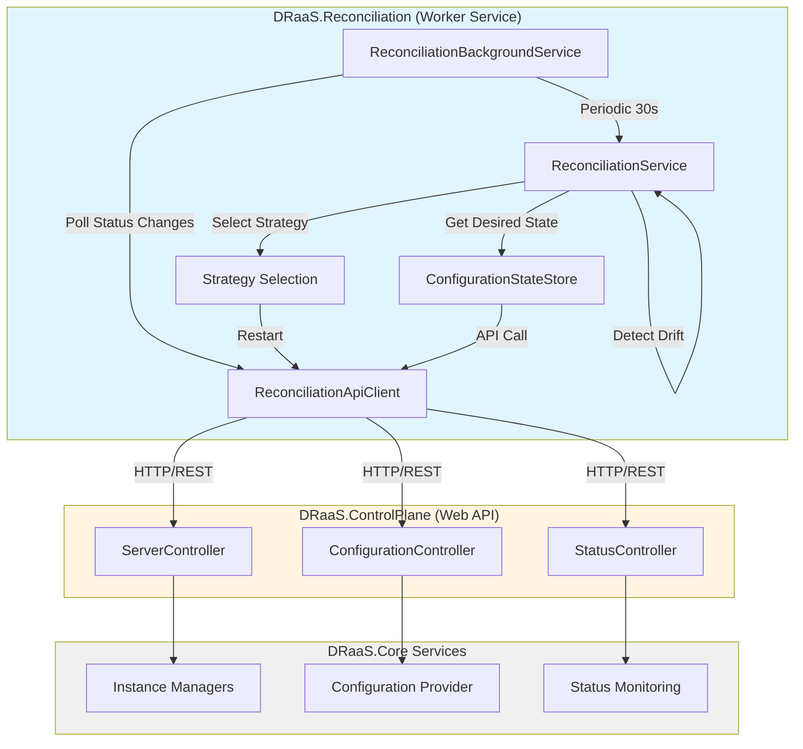
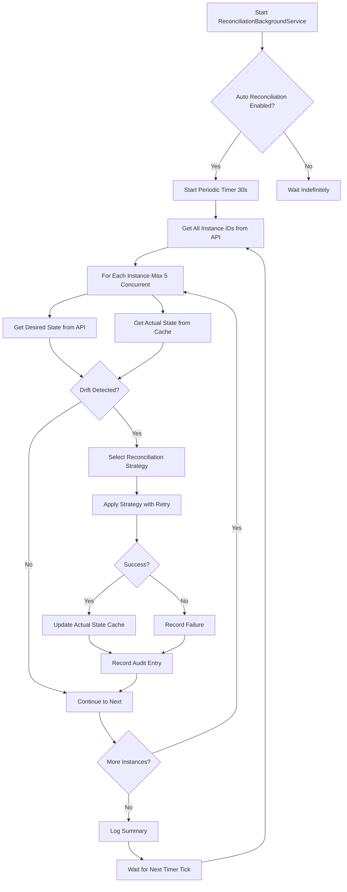
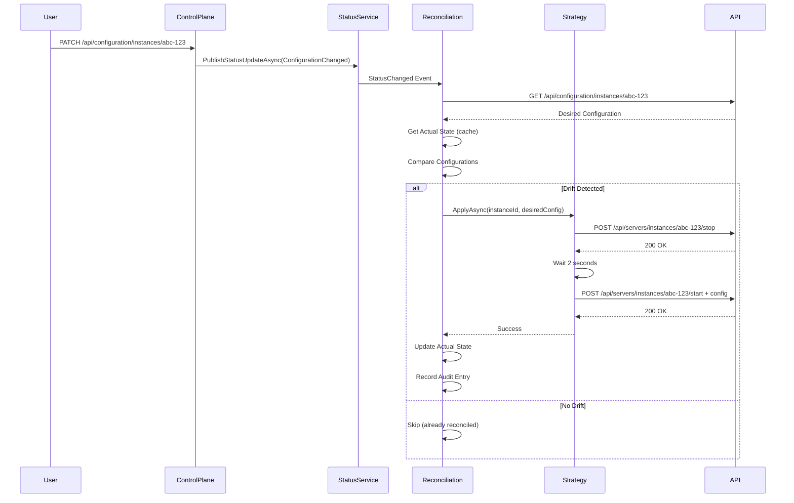
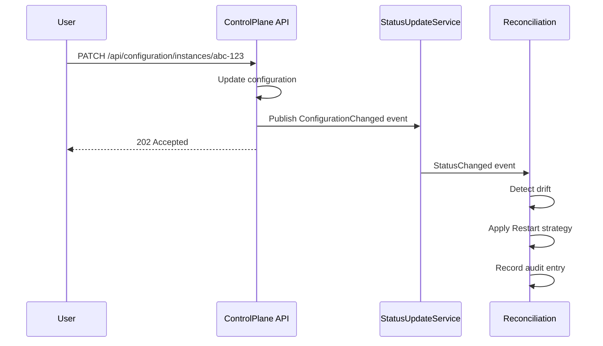

# DRaaS.Reconciliation

**API-Driven Desired State Reconciliation Daemon for DRaaS**

DRaaS.Reconciliation is a **standalone .NET Worker Service** that implements configuration drift detection and automatic reconciliation for Drasi instances. It ensures that running instances always match their desired configuration state by detecting drift and applying corrective actions **through the ControlPlane REST API**.

## Overview

This service implements the **desired state reconciliation pattern** (inspired by Kubernetes operators) where the system continuously works to ensure actual state matches desired state:

1. **Desired State**: Retrieved from ControlPlane API (`GET /api/configuration/instances/{id}`)
2. **Actual State**: Tracked locally in-memory for each instance
3. **Drift Detection**: Compares desired vs actual configurations (host, port, log level, sources, queries, reactions)
4. **Reconciliation**: Applies corrective actions via ControlPlane API endpoints
5. **Audit Trail**: Records all reconciliation actions for compliance and debugging

### Why Reconciliation?

In distributed systems, configuration drift occurs naturally due to:
- Manual changes during troubleshooting
- Failed deployments
- Partial updates
- External configuration changes (Git, API, UI)

Reconciliation provides **GitOps-style continuous convergence** ensuring instances always reflect their intended configuration.

### Why Separate Service?

The reconciliation daemon runs as a **separate service** (not embedded in ControlPlane) to provide:

✅ **Independent Scaling**: Scale reconciliation independently based on instance count  
✅ **Resilience**: ControlPlane downtime doesn't affect reconciliation  
✅ **Resource Isolation**: CPU-intensive drift detection doesn't impact API performance  
✅ **Deployment Flexibility**: Deploy as Windows Service, systemd daemon, or Kubernetes deployment  
✅ **Single Responsibility**: ControlPlane handles API requests, Reconciliation handles convergence

## Technology Stack

- **.NET 10.0** - Worker Service (BackgroundService)
- **DRaaS.Core** - Business logic library (interfaces only)
- **HttpClient** - REST API communication with ControlPlane
- **System.Text.Json** - JSON serialization for API requests/responses
- **Microsoft.Extensions.Hosting** - Generic host for long-running services
- **Microsoft.Extensions.Logging** - Structured logging
- **Microsoft.Extensions.Options** - Strongly-typed configuration

## Project Structure

```
DRaaS.Reconciliation/
├── Strategies/                           # Reconciliation Strategy Implementations
│   ├── IReconciliationStrategy.cs        # Strategy interface
│   └── RestartReconciliationStrategy.cs  # Simple restart strategy (implemented)
├── IReconciliationApiClient.cs           # ControlPlane API client interface
├── ReconciliationApiClient.cs            # HttpClient-based API implementation
├── ConfigurationStateStore.cs            # Desired/actual state tracking
├── ReconciliationService.cs              # Core drift detection & orchestration
├── ReconciliationBackgroundService.cs    # Worker service (periodic + event-driven)
├── Program.cs                            # Application startup & DI
├── appsettings.json                      # Configuration (polling interval, strategies, etc.)
└── README.md                             # This file
```

### Responsibilities

**Reconciliation Contains**:
- Drift detection logic
- Reconciliation strategies (Restart, RollingUpdate, BlueGreen, etc.)
- HTTP API client for ControlPlane
- Background service orchestration (periodic + event-driven)
- Local state tracking (desired vs actual)
- Audit trail recording

**Reconciliation Does NOT Contain**:
- Instance management logic (lives in ControlPlane → Core)
- Platform-specific code (lives in Core providers)
- Configuration storage (lives in ControlPlane)
- Business logic duplication (all operations via API)

## Architecture

### API-Driven Architecture

All operations flow through the ControlPlane REST API, ensuring:
- ✅ **Single Source of Truth**: ControlPlane is the only management path
- ✅ **RBAC Enforcement**: All operations subject to API-level access control
- ✅ **Centralized Audit**: All actions logged through ControlPlane
- ✅ **Consistency**: No duplicate service registrations or state conflicts
- ✅ **Future-Proof**: When ControlPlane adds RBAC, reconciliation inherits it automatically



**Key Flow**:
1. **Periodic Reconciliation**: Every 30s, check all instances for drift
2. **Event Polling**: Poll `/api/status/recent-changes` for `ConfigurationChanged` events
3. **Drift Detection**: Compare desired state (from API) vs actual state (cache)
4. **Strategy Application**: Call ControlPlane APIs (`POST /stop`, `POST /start`)
5. **State Update**: Update local cache after successful reconciliation

## Core Features

### ✅ Implemented

#### 1. Drift Detection
Comprehensive configuration comparison detecting changes in:

**Server Configuration**:
- Host (`127.0.0.1` vs `0.0.0.0`)
- Port (`8080` vs `8081`)
- Log Level (`info` vs `debug`)

**Drasi Components**:
- Sources count (2 vs 3)
- Queries count (5 vs 6)
- Reactions count (1 vs 2)

**Output Example**:
```csharp
DriftDetectionResult {
    HasDrift = true,
    DesiredState = { /* full config */ },
    ActualState = { /* full config */ },
    Differences = [
        "Port: 8080 → 8081",
        "Queries count: 5 → 6",
        "LogLevel: info → debug"
    ]
}
```

#### 2. Restart Reconciliation Strategy
Simple stop-and-start strategy for applying configuration changes:

**Process Flow**:
```
1. Verify instance exists (GET /api/servers/instances/{id})
2. Stop instance (POST /api/servers/instances/{id}/stop)
3. Wait 2 seconds (clean shutdown)
4. Start with new config (POST /api/servers/instances/{id}/start + body)
5. Log success/failure
```

**Characteristics**:
- ✅ Simple and predictable
- ✅ Guaranteed configuration consistency
- ❌ Brief downtime (2-5 seconds)
- 💡 Best for: Development, non-critical instances

#### 3. Periodic Reconciliation
Background loop checking all instances at regular intervals:

**Configuration**:
```json
{
  "Reconciliation": {
    "PollingInterval": "00:00:30",         // Check every 30 seconds
    "EnableAutoReconciliation": true,      // Enable periodic checks
    "MaxConcurrentReconciliations": 5      // Max parallel operations
  }
}
```

**Execution Flow**:
```
Every 30 seconds:
    ├─ Get all instance IDs (GET /api/servers/instances)
    ├─ For each instance (max 5 concurrent):
    │   ├─ Get desired state (GET /api/configuration/instances/{id})
    │   ├─ Get actual state (local cache)
    │   ├─ Compare configurations
    │   └─ If drift detected:
    │       ├─ Select strategy (default: Restart)
    │       ├─ Apply changes (with retries: 3x, 10s delay)
    │       ├─ Update actual state cache
    │       └─ Record audit entry
    └─ Log summary: Total, Drift, Reconciled, Failed
```

**Console Output**:
```
info: DRaaS.Reconciliation.ReconciliationBackgroundService[0]
      Reconciliation cycle complete. Checked: 12, Drift detected: 3, Reconciled: 3, Failed: 0
```

#### 4. Event-Driven Reconciliation
Immediate response to configuration changes:

**Trigger**: `InstanceStatus.ConfigurationChanged` event from ControlPlane

**Flow**:
```
Configuration Change (PATCH /api/configuration/instances/{id})
    ↓
ControlPlane publishes StatusChanged event
    ↓
StatusUpdateService raises event
    ↓
ReconciliationBackgroundService.OnStatusChanged()
    ↓
ReconcileInstanceAsync(instanceId)
    ↓
Drift detected → Apply strategy → Update state → Audit
```

**Benefits**:
- ⚡ Immediate response (no polling delay)
- 🎯 Targeted reconciliation (single instance)
- 📉 Lower resource usage (no full scan)

#### 5. Retry Logic & Timeout Protection
Resilient reconciliation with configurable retry and timeout:

**Retry Configuration**:
```json
{
  "Reconciliation": {
    "MaxRetries": 3,                      // Retry up to 3 times
    "RetryDelay": "00:00:10",             // Wait 10s between retries
    "ReconciliationTimeout": "00:05:00"   // Timeout after 5 minutes
  }
}
```

**Execution**:
```csharp
// Attempt 1
try { await strategy.ApplyAsync(...); } catch { /* wait 10s */ }

// Attempt 2
try { await strategy.ApplyAsync(...); } catch { /* wait 10s */ }

// Attempt 3
try { await strategy.ApplyAsync(...); } catch { /* log failure */ }
```

**Timeout Protection**:
```csharp
using var cts = CancellationTokenSource.CreateLinkedTokenSource(cancellationToken);
cts.CancelAfter(_options.ReconciliationTimeout); // 5 minutes

await strategy.ApplyAsync(instanceId, desiredConfig, cts.Token);
```

#### 6. Audit Trail
Records all reconciliation actions for compliance and debugging:

**Audit Entry**:
```csharp
ReconciliationAuditEntry {
    InstanceId = "abc-123",
    Action = "Reconciled using Restart strategy",
    DriftDetected = true,
    Timestamp = "2025-01-28T14:35:22Z"
}
```

**Storage**:
- In-memory `ConcurrentDictionary<string, List<ReconciliationAuditEntry>>`
- Last 100 entries per instance
- Available via `GetAuditTrailAsync(instanceId)`

**Future Enhancement**: Persist to database (SQL, Cosmos) or log aggregation (Seq, Elasticsearch)

#### 7. Comprehensive Logging
Structured logging at multiple levels:

**Log Levels**:
```
Information: Cycle complete, reconciliation success
Debug: Individual drift detection, API calls
Warning: Retry attempts, non-critical failures
Error: Failed reconciliations, API errors, timeouts
```

**Example Logs**:
```
info: DRaaS.Reconciliation.ReconciliationService[0]
      Drift detected for instance 'abc-123': Port: 8080 → 8081

info: DRaaS.Reconciliation.Strategies.RestartReconciliationStrategy[0]
      Starting restart reconciliation for instance 'abc-123'

info: DRaaS.Reconciliation.ReconciliationApiClient[0]
      Successfully stopped instance 'abc-123'

info: DRaaS.Reconciliation.ReconciliationApiClient[0]
      Successfully started instance 'abc-123'

info: DRaaS.Reconciliation.ReconciliationService[0]
      Reconciliation successful for instance 'abc-123' (attempt 1 of 3)
```

### 🔲 Planned Features

#### 1. Rolling Update Strategy
Zero-downtime updates by creating new instance before removing old:

**Process Flow**:
```
1. Start new instance with updated config (new port)
2. Wait for health check (HTTP 200 on /health)
3. Switch traffic (load balancer update)
4. Stop old instance
5. Release old resources
```

**Pros**: Zero downtime  
**Cons**: Requires 2x resources temporarily, load balancer support  
**Use case**: Production instances with high availability requirements

#### 2. Blue-Green Strategy
Side-by-side deployment with instant cutover:

**Process Flow**:
```
1. Deploy "green" instance alongside "blue"
2. Run smoke tests on "green"
3. Switch traffic from "blue" to "green" (instant)
4. Monitor "green" for N minutes
5. If stable: remove "blue", if issues: rollback to "blue"
```

**Pros**: Instant rollback capability, full testing before cutover  
**Cons**: 2x resources until cleanup  
**Use case**: High-risk configuration changes, major version upgrades

#### 3. Canary Strategy
Gradual traffic shift with metric validation:

**Process Flow**:
```
1. Deploy canary instance with new config
2. Route 5% traffic to canary
3. Monitor metrics (error rate, latency, throughput)
4. If metrics good: increase to 25%, 50%, 100%
5. If metrics bad: rollback immediately
```

**Pros**: Risk mitigation, data-driven validation  
**Cons**: Requires metrics platform, complex orchestration  
**Use case**: High-traffic production, critical configuration changes

#### 4. Manual Approval Strategy
Detect drift but require human approval before reconciliation:

**Process Flow**:
```
1. Detect drift
2. Log drift details + create notification
3. Wait for approval (API call, webhook, CLI command)
4. After approval: apply selected strategy
```

**Pros**: Human oversight, prevent unwanted changes  
**Cons**: Slower response, requires on-call  
**Use case**: Production instances, compliance requirements

#### 5. Health Checks
Verify instance health after reconciliation:

**Checks**:
```
- HTTP /health endpoint returns 200
- Process is running (not crashed)
- Port is listening
- Drasi sources connected
- Query engine responsive
```

**Validation**:
```csharp
await reconcileStrategy.ApplyAsync(...);
await Task.Delay(5000); // stabilization period
var healthy = await healthChecker.CheckHealthAsync(instanceId);
if (!healthy) {
    await rollbackStrategy.RollbackAsync(instanceId);
}
```

#### 6. Automatic Rollback
Revert failed reconciliations automatically:

**Implementation**:
```csharp
var previousConfig = await stateStore.GetActualStateAsync(instanceId);

try {
    await strategy.ApplyAsync(instanceId, desiredConfig);
    var health = await healthChecker.CheckHealthAsync(instanceId);

    if (!health.IsHealthy) {
        // Rollback to previous configuration
        await strategy.ApplyAsync(instanceId, previousConfig);
    }
} catch {
    // Rollback on exception
    await strategy.ApplyAsync(instanceId, previousConfig);
}
```

## Configuration

### appsettings.json

Full configuration reference:

```json
{
  "Logging": {
    "LogLevel": {
      "Default": "Information",
      "Microsoft.Hosting.Lifetime": "Information",
      "DRaaS.Reconciliation": "Debug"
    }
  },
  "ControlPlaneUrl": "http://localhost:5000",
  "Reconciliation": {
    "PollingInterval": "00:00:30",
    "DefaultStrategy": "Restart",
    "EnableAutoReconciliation": true,
    "EnableEventDrivenReconciliation": true,
    "MaxRetries": 3,
    "RetryDelay": "00:00:10",
    "MaxConcurrentReconciliations": 5,
    "EnableAuditLogging": true,
    "ReconciliationTimeout": "00:05:00",
    "ReconcileErrorInstances": true,
    "ReconcileStoppedInstances": false
  }
}
```

### Configuration Options

| Setting | Type | Default | Description |
|---------|------|---------|-------------|
| **ControlPlaneUrl** | `string` | `http://localhost:5000` | Base URL for ControlPlane API |
| **PollingInterval** | `TimeSpan` | `00:00:30` | How often to check all instances for drift |
| **DefaultStrategy** | `string` | `Restart` | Default reconciliation strategy (`Restart`, `RollingUpdate`, `BlueGreen`, `Canary`, `Manual`) |
| **EnableAutoReconciliation** | `bool` | `true` | Enable periodic reconciliation loop |
| **EnableEventDrivenReconciliation** | `bool` | `true` | Enable immediate reconciliation on ConfigurationChanged events |
| **MaxRetries** | `int` | `3` | Number of retry attempts for failed reconciliations |
| **RetryDelay** | `TimeSpan` | `00:00:10` | Delay between retry attempts |
| **MaxConcurrentReconciliations** | `int` | `5` | Maximum number of concurrent reconciliation operations |
| **EnableAuditLogging** | `bool` | `true` | Record all reconciliation actions to audit trail |
| **ReconciliationTimeout** | `TimeSpan` | `00:05:00` | Timeout for a single reconciliation operation |
| **ReconcileErrorInstances** | `bool` | `true` | Attempt to reconcile instances in `Error` state |
| **ReconcileStoppedInstances** | `bool` | `false` | Skip instances in `Stopped` state (don't restart them) |

### Environment Variable Overrides

All settings support environment variable overrides:

```bash
# Windows
set ControlPlaneUrl=http://api.draas.prod:5000
set Reconciliation__PollingInterval=00:01:00
set Reconciliation__MaxRetries=5

# Linux/macOS
export ControlPlaneUrl=http://api.draas.prod:5000
export Reconciliation__PollingInterval=00:01:00
export Reconciliation__MaxRetries=5

# Kubernetes
env:
- name: ControlPlaneUrl
  value: "http://draas-controlplane-svc:5000"
- name: Reconciliation__PollingInterval
  value: "00:01:00"
- name: Reconciliation__DefaultStrategy
  value: "RollingUpdate"
```
```

## Running the Service

### Prerequisites

✅ **ControlPlane must be running**: Reconciliation requires ControlPlane API to be accessible  
✅ **Instances must exist**: Create at least one instance via ControlPlane API  
✅ **Network connectivity**: Reconciliation must reach ControlPlane URL  
✅ **.NET 10 SDK**: Required to build and run

### Development: Side-by-Side Processes

Run ControlPlane and Reconciliation in separate terminals:

```bash
# Terminal 1: Start ControlPlane
cd src/DRaaS.ControlPlane
dotnet run

# Console Output:
# info: Microsoft.Hosting.Lifetime[14]
#       Now listening on: http://localhost:5000
# info: Microsoft.Hosting.Lifetime[0]
#       Application started. Press Ctrl+C to shut down.

# Terminal 2: Start Reconciliation
cd src/DRaaS.Reconciliation
dotnet run

# Console Output:
# info: DRaaS.Reconciliation.ReconciliationBackgroundService[0]
#       Reconciliation Background Service starting...
# info: DRaaS.Reconciliation.ReconciliationBackgroundService[0]
#       Event-driven reconciliation enabled
# info: DRaaS.Reconciliation.ReconciliationBackgroundService[0]
#       Periodic reconciliation enabled with interval: 00:00:30
```

### Production: Windows Service

Install as a persistent Windows Service:

```powershell
# 1. Publish the application
cd src/DRaaS.Reconciliation
dotnet publish -c Release -o C:\DRaaS\Reconciliation

# 2. Install as Windows Service
sc create DRaaSReconciliation `
    binPath="C:\DRaaS\Reconciliation\DRaaS.Reconciliation.exe" `
    start=auto `
    DisplayName="DRaaS Reconciliation Service"

# 3. Start the service
sc start DRaaSReconciliation

# 4. Check status
sc query DRaaSReconciliation

# 5. View logs (Event Viewer or configure file logging)

# Uninstall (if needed)
sc stop DRaaSReconciliation
sc delete DRaaSReconciliation
```

### Production: Linux systemd Service

Deploy as a systemd daemon on Linux:

```bash
# 1. Publish the application
cd src/DRaaS.Reconciliation
dotnet publish -c Release -r linux-x64 --self-contained -o /opt/draas/reconciliation

# 2. Create systemd service file
sudo nano /etc/systemd/system/draas-reconciliation.service
```

**Service File** (`/etc/systemd/system/draas-reconciliation.service`):
```ini
[Unit]
Description=DRaaS Reconciliation Service
After=network.target

[Service]
Type=notify
WorkingDirectory=/opt/draas/reconciliation
ExecStart=/opt/draas/reconciliation/DRaaS.Reconciliation
Restart=always
RestartSec=10
KillSignal=SIGINT
SyslogIdentifier=draas-reconciliation
User=draas
Environment="DOTNET_PRINT_TELEMETRY_MESSAGE=false"
Environment="ControlPlaneUrl=http://controlplane.draas.internal:5000"

[Install]
WantedBy=multi-user.target
```

```bash
# 3. Reload systemd and start service
sudo systemctl daemon-reload
sudo systemctl enable draas-reconciliation
sudo systemctl start draas-reconciliation

# 4. Check status
sudo systemctl status draas-reconciliation

# 5. View logs
sudo journalctl -u draas-reconciliation -f

# 6. Restart/stop
sudo systemctl restart draas-reconciliation
sudo systemctl stop draas-reconciliation
```

### Production: Kubernetes Deployment

Deploy as a Kubernetes Deployment with automatic restarts:

**Deployment Manifest** (`reconciliation-deployment.yaml`):
```yaml
apiVersion: apps/v1
kind: Deployment
metadata:
  name: draas-reconciliation
  namespace: draas-system
  labels:
    app: draas-reconciliation
    component: reconciliation
spec:
  replicas: 1  # Single instance recommended (leader election for multi-replica)
  selector:
    matchLabels:
      app: draas-reconciliation
  template:
    metadata:
      labels:
        app: draas-reconciliation
        component: reconciliation
    spec:
      serviceAccountName: draas-reconciliation
      containers:
      - name: reconciliation
        image: draas.azurecr.io/draas-reconciliation:latest
        imagePullPolicy: Always
        env:
        - name: ControlPlaneUrl
          value: "http://draas-controlplane-svc:5000"
        - name: Reconciliation__PollingInterval
          value: "00:00:30"
        - name: Reconciliation__DefaultStrategy
          value: "Restart"
        - name: Reconciliation__MaxRetries
          value: "3"
        - name: Reconciliation__MaxConcurrentReconciliations
          value: "10"
        - name: DOTNET_gcServer
          value: "true"
        resources:
          requests:
            cpu: "100m"
            memory: "256Mi"
          limits:
            cpu: "500m"
            memory: "512Mi"
        livenessProbe:
          httpGet:
            path: /health  # Future: Add health endpoint
            port: 8080
          initialDelaySeconds: 30
          periodSeconds: 30
        readinessProbe:
          httpGet:
            path: /ready  # Future: Add readiness endpoint
            port: 8080
          initialDelaySeconds: 10
          periodSeconds: 10
---
apiVersion: v1
kind: ServiceAccount
metadata:
  name: draas-reconciliation
  namespace: draas-system
```

**Deploy**:
```bash
# Apply deployment
kubectl apply -f reconciliation-deployment.yaml

# Check status
kubectl get deployment draas-reconciliation -n draas-system
kubectl get pods -n draas-system -l app=draas-reconciliation

# View logs
kubectl logs -n draas-system deployment/draas-reconciliation -f

# Scale (future: with leader election)
kubectl scale deployment draas-reconciliation -n draas-system --replicas=3
```

### Docker Compose (Development)

Run ControlPlane + Reconciliation together:

**docker-compose.yml**:
```yaml
version: '3.8'

services:
  controlplane:
    build:
      context: ./src/DRaaS.ControlPlane
      dockerfile: Dockerfile
    ports:
      - "5000:8080"
    environment:
      - ASPNETCORE_ENVIRONMENT=Development
      - ASPNETCORE_URLS=http://+:8080
    networks:
      - draas-network

  reconciliation:
    build:
      context: ./src/DRaaS.Reconciliation
      dockerfile: Dockerfile
    environment:
      - ControlPlaneUrl=http://controlplane:8080
      - Reconciliation__PollingInterval=00:00:30
      - Reconciliation__EnableAutoReconciliation=true
      - Reconciliation__EnableEventDrivenReconciliation=true
    depends_on:
      - controlplane
    networks:
      - draas-network

networks:
  draas-network:
    driver: bridge
```

```bash
# Start both services
docker-compose up -d

# View logs
docker-compose logs -f reconciliation

# Stop
docker-compose down
```

## How It Works

### Reconciliation Loop Lifecycle



### Event-Driven Flow



### Drift Detection Algorithm

The reconciliation service performs deep comparison of configurations:

```csharp
public DriftDetectionResult CompareConfigurations(
    Configuration desired,
    Configuration actual)
{
    var differences = new List<string>();

    // Server configuration comparison
    if (desired.ServerConfiguration?.Host != actual.ServerConfiguration?.Host)
        differences.Add($"Host: {actual.ServerConfiguration?.Host} → {desired.ServerConfiguration?.Host}");

    if (desired.ServerConfiguration?.Port != actual.ServerConfiguration?.Port)
        differences.Add($"Port: {actual.ServerConfiguration?.Port} → {desired.ServerConfiguration?.Port}");

    if (desired.ServerConfiguration?.LogLevel != actual.ServerConfiguration?.LogLevel)
        differences.Add($"LogLevel: {actual.ServerConfiguration?.LogLevel} → {desired.ServerConfiguration?.LogLevel}");

    // Component count comparison
    var desiredSourcesCount = desired.Sources?.Count ?? 0;
    var actualSourcesCount = actual.Sources?.Count ?? 0;
    if (desiredSourcesCount != actualSourcesCount)
        differences.Add($"Sources count: {actualSourcesCount} → {desiredSourcesCount}");

    var desiredQueriesCount = desired.Queries?.Count ?? 0;
    var actualQueriesCount = actual.Queries?.Count ?? 0;
    if (desiredQueriesCount != actualQueriesCount)
        differences.Add($"Queries count: {actualQueriesCount} → {desiredQueriesCount}");

    var desiredReactionsCount = desired.Reactions?.Count ?? 0;
    var actualReactionsCount = actual.Reactions?.Count ?? 0;
    if (desiredReactionsCount != actualReactionsCount)
        differences.Add($"Reactions count: {actualReactionsCount} → {desiredReactionsCount}");

    return new DriftDetectionResult
    {
        HasDrift = differences.Any(),
        DesiredState = desired,
        ActualState = actual,
        Differences = differences
    };
}
```

**Future Enhancement**: Deep comparison of individual sources, queries, and reactions (not just counts)

## API Client Implementation

### IReconciliationApiClient Interface

```csharp
public interface IReconciliationApiClient
{
    Task<DrasiInstance?> GetInstanceAsync(string instanceId);
    Task<IEnumerable<DrasiInstance>> GetAllInstancesAsync();
    Task<bool> StartInstanceAsync(string instanceId, Configuration? configuration = null);
    Task<bool> StopInstanceAsync(string instanceId);
    Task<bool> RestartInstanceAsync(string instanceId);
    Task<Configuration?> GetConfigurationAsync(string instanceId);
    Task<bool> UpdateConfigurationAsync(string instanceId, JsonPatchDocument<Configuration> patch);
}
```

### ReconciliationApiClient Implementation

```csharp
public class ReconciliationApiClient : IReconciliationApiClient
{
    private readonly HttpClient _httpClient;
    private readonly ILogger<ReconciliationApiClient> _logger;

    public ReconciliationApiClient(HttpClient httpClient, ILogger<ReconciliationApiClient> logger)
    {
        _httpClient = httpClient;
        _logger = logger;
    }

    public async Task<bool> StartInstanceAsync(string instanceId, Configuration? configuration = null)
    {
        try
        {
            HttpResponseMessage response;

            if (configuration != null)
            {
                // POST with configuration in body
                response = await _httpClient.PostAsJsonAsync(
                    $"/api/servers/instances/{instanceId}/start",
                    configuration);
            }
            else
            {
                // POST without body (use stored config)
                response = await _httpClient.PostAsync(
                    $"/api/servers/instances/{instanceId}/start",
                    null);
            }

            if (!response.IsSuccessStatusCode)
            {
                _logger.LogWarning(
                    "Failed to start instance {InstanceId}. Status: {StatusCode}",
                    instanceId,
                    response.StatusCode);
                return false;
            }

            _logger.LogInformation("Successfully started instance {InstanceId}", instanceId);
            return true;
        }
        catch (Exception ex)
        {
            _logger.LogError(ex, "Error starting instance {InstanceId}", instanceId);
            return false;
        }
    }
}
```

**Key Features**:
- ✅ Structured logging with instance IDs
- ✅ Proper exception handling
- ✅ HTTP status code validation
- ✅ Retry-friendly (returns `bool`, not throws)

## Reconciliation Strategies

### Current: Restart Strategy

**Implementation**: `RestartReconciliationStrategy.cs`

```csharp
public class RestartReconciliationStrategy : IReconciliationStrategy
{
    private readonly IReconciliationApiClient _apiClient;
    private readonly ILogger<RestartReconciliationStrategy> _logger;

    public ReconciliationStrategy StrategyType => ReconciliationStrategy.Restart;

    public async Task<bool> ApplyAsync(
        string instanceId,
        Configuration desiredConfiguration,
        CancellationToken cancellationToken)
    {
        try
        {
            // 1. Verify instance exists
            var instance = await _apiClient.GetInstanceAsync(instanceId);
            if (instance == null) return false;

            // 2. Stop instance
            var stopped = await _apiClient.StopInstanceAsync(instanceId);
            if (!stopped) return false;

            // 3. Wait for clean shutdown
            await Task.Delay(TimeSpan.FromSeconds(2), cancellationToken);

            // 4. Start with new configuration
            var started = await _apiClient.StartInstanceAsync(instanceId, desiredConfiguration);
            return started;
        }
        catch (OperationCanceledException)
        {
            _logger.LogWarning("Reconciliation cancelled for instance {InstanceId}", instanceId);
            throw;
        }
        catch (Exception ex)
        {
            _logger.LogError(ex, "Error during restart reconciliation for instance {InstanceId}", instanceId);
            return false;
        }
    }
}
```

**Downtime Calculation**:
- Stop time: 1-2 seconds
- Delay: 2 seconds
- Start time: 1-2 seconds
- **Total**: 4-6 seconds

### Future: Rolling Update Strategy

**Concept**:
```csharp
public class RollingUpdateReconciliationStrategy : IReconciliationStrategy
{
    public async Task<bool> ApplyAsync(...)
    {
        // 1. Allocate new port
        var newPort = await _portAllocator.AllocatePort();
        var newConfig = desiredConfiguration with { ServerConfiguration = new() { Port = newPort } };

        // 2. Start new instance
        await _apiClient.StartInstanceAsync($"{instanceId}-temp", newConfig);

        // 3. Wait for health check
        await WaitForHealthAsync($"{instanceId}-temp", TimeSpan.FromSeconds(30));

        // 4. Update load balancer / switch traffic
        await _loadBalancer.SwitchTrafficAsync(instanceId, $"{instanceId}-temp");

        // 5. Stop old instance
        await _apiClient.StopInstanceAsync(instanceId);

        // 6. Rename temp instance to original ID
        await _apiClient.RenameInstanceAsync($"{instanceId}-temp", instanceId);

        // 7. Release old port
        await _portAllocator.ReleasePort(oldPort);

        return true;
    }
}
```

**Downtime**: 0 seconds (seamless cutover)  
**Resource Overhead**: 2x (during transition)  
**Complexity**: High (requires load balancer integration)

### Future: Blue-Green Strategy

**Concept**:
```csharp
public class BlueGreenReconciliationStrategy : IReconciliationStrategy
{
    public async Task<bool> ApplyAsync(...)
    {
        var currentColor = await _stateStore.GetColorAsync(instanceId); // "blue" or "green"
        var newColor = currentColor == "blue" ? "green" : "blue";

        // 1. Deploy new color
        await _apiClient.CreateInstanceAsync($"{instanceId}-{newColor}", desiredConfiguration);
        await _apiClient.StartInstanceAsync($"{instanceId}-{newColor}", desiredConfiguration);

        // 2. Run smoke tests
        var testsPass = await _testRunner.RunSmokeTestsAsync($"{instanceId}-{newColor}");
        if (!testsPass)
        {
            await _apiClient.DeleteInstanceAsync($"{instanceId}-{newColor}");
            return false; // Rollback
        }

        // 3. Switch traffic
        await _loadBalancer.SwitchTrafficAsync(instanceId, $"{instanceId}-{newColor}");

        // 4. Monitor for stability period (e.g., 5 minutes)
        await Task.Delay(TimeSpan.FromMinutes(5));

        // 5. If stable, delete old color
        await _apiClient.StopInstanceAsync($"{instanceId}-{currentColor}");
        await _apiClient.DeleteInstanceAsync($"{instanceId}-{currentColor}");

        // 6. Update current color
        await _stateStore.SetColorAsync(instanceId, newColor);

        return true;
    }
}
```

**Downtime**: 0 seconds  
**Rollback Time**: Instant (switch back to old color)  
**Resource Overhead**: 2x (until cleanup)  
**Complexity**: Very high (requires load balancer, testing framework)

## Troubleshooting

### Common Issues

#### 1. Reconciliation Not Running

**Symptom**: No logs, no reconciliation cycles

**Causes**:
- `EnableAutoReconciliation = false`
- ControlPlane unreachable
- Application crashed

**Solution**:
```bash
# Check if service is running
sc query DRaaSReconciliation  # Windows
sudo systemctl status draas-reconciliation  # Linux
kubectl get pods -n draas-system  # Kubernetes

# Check logs for startup errors
# Look for: "Reconciliation Background Service starting..."

# Verify configuration
cat appsettings.json | grep EnableAutoReconciliation
```

#### 2. "Failed to get all instances from ControlPlane"

**Symptom**: Error in logs: `Failed to get all instances from ControlPlane`

**Causes**:
- ControlPlane not running
- Wrong `ControlPlaneUrl` in config
- Network firewall blocking

**Solution**:
```bash
# Test connectivity
curl http://localhost:5000/api/servers/instances

# Check configuration
cat appsettings.json | grep ControlPlaneUrl

# Verify ControlPlane is running
netstat -an | grep 5000  # Windows
ss -tuln | grep 5000     # Linux
```

#### 3. Drift Detected But Not Reconciling

**Symptom**: Logs show "Drift detected" but no reconciliation attempt

**Causes**:
- Max concurrent reconciliations reached (5 default)
- Instance in `Error` state and `ReconcileErrorInstances = false`
- Instance in `Stopped` state and `ReconcileStoppedInstances = false`

**Solution**:
```json
// Increase concurrency
{
  "Reconciliation": {
    "MaxConcurrentReconciliations": 10,
    "ReconcileErrorInstances": true,
    "ReconcileStoppedInstances": true
  }
}
```

#### 4. Reconciliation Timing Out

**Symptom**: Error: "Reconciliation timed out after 00:05:00"

**Causes**:
- Slow instance startup
- Network latency
- Platform issues (Docker/AKS slow)

**Solution**:
```json
// Increase timeout
{
  "Reconciliation": {
    "ReconciliationTimeout": "00:10:00"  // 10 minutes
  }
}
```

#### 5. Too Many Retries

**Symptom**: Logs show multiple retry attempts, all failing

**Causes**:
- Invalid configuration
- Platform unavailable
- Permissions issue

**Solution**:
```bash
# Check last reconciliation attempt details
# Look for error messages in logs

# Manually test the operation
curl -X POST http://localhost:5000/api/servers/instances/abc-123/start

# Check instance status
curl http://localhost:5000/api/servers/instances/abc-123
```

### Debugging Checklist

✅ **ControlPlane is running and accessible**  
✅ **ControlPlaneUrl is correct in appsettings.json**  
✅ **At least one instance exists in ControlPlane**  
✅ **Instance has valid configuration**  
✅ **Network connectivity between Reconciliation and ControlPlane**  
✅ **Reconciliation service is running (`EnableAutoReconciliation = true`)**  
✅ **Logs show periodic cycles or event-driven triggers**  
✅ **No firewall/network policies blocking HTTP traffic**

### Enabling Debug Logging

```json
{
  "Logging": {
    "LogLevel": {
      "Default": "Information",
      "DRaaS.Reconciliation": "Debug",
      "DRaaS.Reconciliation.ReconciliationApiClient": "Debug",
      "DRaaS.Reconciliation.Strategies": "Debug"
    }
  }
}
```

**Debug logs include**:
- API request/response details
- Drift detection comparisons
- Strategy selection reasoning
- Retry attempt tracking
- Detailed error messages

## Performance Considerations

### Resource Usage

**Memory**:
- Base: ~50 MB
- Per instance audit trail (100 entries): ~1 KB
- Per instance actual state cache: ~5 KB
- **Total for 1000 instances**: ~55 MB

**CPU**:
- Periodic reconciliation: <5% (30s polling)
- Event-driven reconciliation: <1% (idle)
- Drift detection: <1% per instance
- Strategy application: Depends on platform (API calls)

**Network**:
- Per periodic cycle (1000 instances): ~1-2 MB (GET requests)
- Per reconciliation: ~5-10 KB (GET config + POST start/stop)
- **Bandwidth for 1000 instances (30s polling)**: ~2-4 MB/min

### Scaling Recommendations

| Instance Count | Polling Interval | Max Concurrent | Recommended Resources |
|----------------|------------------|----------------|------------------------|
| 1-50 | 30s | 5 | 256 MB RAM, 0.1 CPU |
| 51-200 | 30s | 10 | 512 MB RAM, 0.2 CPU |
| 201-500 | 60s | 20 | 1 GB RAM, 0.5 CPU |
| 501-1000 | 120s | 30 | 2 GB RAM, 1.0 CPU |
| 1000+ | 300s | 50 | 4 GB RAM, 2.0 CPU |

**Future Enhancement**: Shard reconciliation across multiple instances with leader election

## Testing

### Unit Testing

```csharp
[Fact]
public async Task RestartStrategy_Should_Stop_Then_Start_Instance()
{
    // Arrange
    var apiClientMock = new Mock<IReconciliationApiClient>();
    apiClientMock.Setup(x => x.GetInstanceAsync("test-123"))
        .ReturnsAsync(new DrasiInstance { Id = "test-123", Status = InstanceStatus.Running });
    apiClientMock.Setup(x => x.StopInstanceAsync("test-123")).ReturnsAsync(true);
    apiClientMock.Setup(x => x.StartInstanceAsync("test-123", It.IsAny<Configuration>())).ReturnsAsync(true);

    var strategy = new RestartReconciliationStrategy(apiClientMock.Object, loggerMock.Object);
    var config = new Configuration { /* ... */ };

    // Act
    var result = await strategy.ApplyAsync("test-123", config, CancellationToken.None);

    // Assert
    Assert.True(result);
    apiClientMock.Verify(x => x.StopInstanceAsync("test-123"), Times.Once);
    apiClientMock.Verify(x => x.StartInstanceAsync("test-123", config), Times.Once);
}
```

### Integration Testing

```csharp
[Fact]
public async Task EndToEnd_Configuration_Change_Triggers_Reconciliation()
{
    // Arrange: Start ControlPlane and Reconciliation in TestServer
    var controlPlaneFactory = new WebApplicationFactory<ControlPlane.Program>();
    var reconciliationHost = new HostBuilder()
        .ConfigureServices(services => {
            services.AddHttpClient<IReconciliationApiClient, ReconciliationApiClient>(client => {
                client.BaseAddress = new Uri("http://localhost");
            });
            services.AddHostedService<ReconciliationBackgroundService>();
        })
        .Build();

    // Act: Create instance, change configuration, wait for reconciliation
    var client = controlPlaneFactory.CreateClient();
    var createResponse = await client.PostAsJsonAsync("/api/servers/instances", new { name = "test" });
    var instance = await createResponse.Content.ReadFromJsonAsync<DrasiInstance>();

    var patchDoc = new JsonPatchDocument<Configuration>();
    patchDoc.Replace(x => x.ServerConfiguration.Port, 9090);
    await client.PatchAsJsonAsync($"/api/configuration/instances/{instance.Id}", patchDoc);

    await Task.Delay(TimeSpan.FromSeconds(5)); // Wait for event-driven reconciliation

    // Assert: Verify instance was reconciled
    var finalInstance = await client.GetFromJsonAsync<DrasiInstance>($"/api/servers/instances/{instance.Id}");
    Assert.Equal(InstanceStatus.Running, finalInstance.Status);
}
```

## Contributing

### Adding a New Reconciliation Strategy

1. Create strategy class in `Strategies/` folder
2. Implement `IReconciliationStrategy` interface
3. Register in DI: `services.AddSingleton<IReconciliationStrategy, YourStrategy>()`
4. Add enum value to `ReconciliationStrategy` enum (in Core)
5. Update `appsettings.json` with new strategy name
6. Add tests
7. Update README

**Example**:
```csharp
public class CanaryReconciliationStrategy : IReconciliationStrategy
{
    public ReconciliationStrategy StrategyType => ReconciliationStrategy.Canary;

    public async Task<bool> ApplyAsync(
        string instanceId,
        Configuration desiredConfiguration,
        CancellationToken cancellationToken)
    {
        // Your implementation here
    }
}
```

## Roadmap

### Q1 2025
- ✅ Restart strategy
- ✅ API-driven architecture
- ✅ Periodic + event-driven reconciliation
- ✅ Retry logic & timeout
- ✅ Audit trail
- 🔲 Health check endpoint (`/health`, `/ready`)
- 🔲 Metrics endpoint (`/metrics` for Prometheus)

### Q2 2025
- 🔲 Rolling update strategy
- 🔲 Blue-green strategy
- 🔲 Database persistence for audit trail (SQL, Cosmos)
- 🔲 Leader election for multi-replica deployments

### Q3 2025
- 🔲 Canary strategy with metrics validation
- 🔲 Manual approval workflow
- 🔲 Automatic rollback on failure
- 🔲 Web UI for audit trail visualization

### Q4 2025
- 🔲 Deep configuration comparison (individual sources/queries/reactions)
- 🔲 Custom reconciliation policies per instance
- 🔲 Scheduled reconciliation windows
- 🔲 Reconciliation simulation mode (dry-run)

## License

This project is part of DRaaS (Drasi-as-a-Service) and follows the same license as the parent repository.

## Related Documentation

- [DRaaS.Core README](../DRaaS.Core/README.md) - Business logic library
- [DRaaS.ControlPlane README](../DRaaS.ControlPlane/README.md) - REST API frontend
- [DRaaS Root README](../../README.md) - Project overview and architecture
- [Distributed Monitoring Documentation](../DRaaS.Core/DISTRIBUTED_MONITORING.md) - Status update architecture
- [Services Organization](../DRaaS.Core/Services/README.md) - Service layer documentation

## Support

For issues, questions, or contributions:
- **GitHub Issues**: [https://github.com/samirbanjanovic/draas/issues](https://github.com/samirbanjanovic/draas/issues)
- **Discussions**: [https://github.com/samirbanjanovic/draas/discussions](https://github.com/samirbanjanovic/draas/discussions)
```
info: DRaaS.Reconciliation.ReconciliationBackgroundService[0]
      Reconciliation Background Service starting...
info: DRaaS.Reconciliation.ReconciliationBackgroundService[0]
      Event-driven reconciliation enabled
info: DRaaS.Reconciliation.ReconciliationBackgroundService[0]
      Periodic reconciliation enabled with interval: 00:00:30
info: DRaaS.Reconciliation.ReconciliationBackgroundService[0]
      Reconciliation cycle complete. Checked: 5, Drift detected: 2, Reconciled: 2, Failed: 0
```

### As Windows Service

```bash
# Publish
dotnet publish -c Release

# Install as Windows Service
sc create DRaaSReconciliation binPath="C:\path\to\DRaaS.Reconciliation.exe"
sc start DRaaSReconciliation
```

### As Kubernetes Deployment

**Important**: Ensure the ControlPlane service is accessible from the reconciliation pod.

```yaml
apiVersion: apps/v1
kind: Deployment
metadata:
  name: draas-reconciliation
  namespace: draas-system
spec:
  replicas: 1
  selector:
    matchLabels:
      app: draas-reconciliation
  template:
    metadata:
      labels:
        app: draas-reconciliation
    spec:
      containers:
      - name: reconciliation
        image: draas-reconciliation:latest
        env:
        - name: ControlPlaneUrl
          value: "http://draas-controlplane:5000"  # ControlPlane service URL
        - name: Reconciliation__PollingInterval
          value: "00:00:30"
        - name: Reconciliation__DefaultStrategy
          value: "Restart"
```

### ~~In-Process with ControlPlane~~ (Not Recommended)

**API-driven architecture eliminates the need for in-process hosting.** The reconciliation service is now lightweight and should always run as a separate daemon/service. This provides:
- Better separation of concerns
- Independent scaling
- Simplified deployment
- No duplicate service registrations

## How It Works

### Periodic Reconciliation

```
Every 30 seconds:
    ├─ Get all instance IDs
    ├─ For each instance (max 5 concurrent):
    │   ├─ Get desired state (from ConfigurationProvider)
    │   ├─ Get actual state (tracked locally)
    │   ├─ Compare configurations
    │   └─ If drift detected:
    │       ├─ Select strategy (default: Restart)
    │       ├─ Apply changes (with retries)
    │       ├─ Update actual state
    │       └─ Record audit entry
    └─ Log summary (total checked, drift found, success, failures)
```

### Event-Driven Reconciliation

```
Configuration Change Event (InstanceStatus.ConfigurationChanged):
    ├─ Detect drift for specific instance
    ├─ If drift detected:
    │   ├─ Apply reconciliation strategy
    │   ├─ Update actual state
    │   └─ Record audit entry
    └─ Log result
```

### Drift Detection

Compares:
- **Host**: `127.0.0.1` vs `0.0.0.0`
- **Port**: `8080` vs `8081`
- **Log Level**: `info` vs `debug`
- **Sources Count**: 2 vs 3
- **Queries Count**: 5 vs 6
- **Reactions Count**: 1 vs 2

Returns:
```csharp
DriftDetectionResult {
    HasDrift = true,
    Differences = [
        "Port: 8080 → 8081",
        "Queries count: 5 → 6"
    ]
}
```

## Reconciliation Strategies

### Restart (Implemented)

**How it works**:
1. Call `POST /api/servers/instances/{id}/stop` (ControlPlane API)
2. Wait 2 seconds for clean shutdown
3. Call `POST /api/servers/instances/{id}/start` with new configuration (ControlPlane API)

**Pros**: Simple, predictable, centrally managed  
**Cons**: Downtime (2-5 seconds)

**Use case**: Development, non-critical instances

**Implementation**: `RestartReconciliationStrategy` uses `IReconciliationApiClient` to call ControlPlane APIs

### Rolling Update (Future)

**How it works**:
1. Start new instance with updated config
2. Wait for health check
3. Stop old instance

**Pros**: Zero downtime  
**Cons**: Requires 2x resources temporarily

**Use case**: Production with load balancing

### Blue-Green (Future)

**How it works**:
1. Deploy new "green" instance
2. Run both side-by-side
3. Switch traffic from "blue" to "green"
4. Remove old "blue" instance

**Pros**: Instant rollback capability  
**Cons**: Requires traffic routing, 2x resources

**Use case**: Critical production services

### Canary (Future)

**How it works**:
1. Deploy new instance
2. Route 10% of traffic to it
3. Monitor metrics
4. If healthy, increase to 50%, then 100%
5. Remove old instance

**Pros**: Safest, gradual rollout  
**Cons**: Complex, requires metrics and routing

**Use case**: High-risk production changes

## Integration with ControlPlane



## Monitoring & Observability

### Logs

```
[17:00:00 INF] Reconciliation Background Service starting...
[17:00:30 DBG] Starting periodic reconciliation cycle
[17:00:32 INF] Reconciliation cycle complete. Checked: 10, Drift detected: 3, Reconciled: 3, Failed: 0
[17:01:15 INF] Configuration change detected for instance abc-123, triggering reconciliation
[17:01:16 INF] Successfully reconciled instance abc-123 using Restart
```

### Metrics (Future)

- `reconciliation_cycles_total`: Total reconciliation cycles
- `reconciliation_drift_detected_total`: Instances with drift
- `reconciliation_success_total`: Successful reconciliations
- `reconciliation_failures_total`: Failed reconciliations
- `reconciliation_duration_seconds`: Time per reconciliation

### Audit Trail

Query audit history (stored in memory, limit 100 per instance):

```csharp
var auditStore = (ConfigurationStateStore)stateStore;
var entries = await auditStore.GetAuditTrailAsync("abc-123");

foreach (var entry in entries)
{
    Console.WriteLine($"{entry.Timestamp}: {entry.Action}");
}
```

## Deployment Patterns

### Pattern 1: Separate Service (Recommended)

```
┌─────────────────┐       ┌──────────────────────┐
│ ControlPlane    │       │ Reconciliation       │
│ (Web API)       │       │ (Daemon)             │
└─────────────────┘       └──────────────────────┘
         │                          │
         └──────────┬───────────────┘
                    ▼
           Shared Storage
           (Cosmos, Redis, SQL)
```

**Benefits**: Scale independently, fault isolation, clear responsibilities

### Pattern 2: In-Process (Development)

```
┌─────────────────────────────────┐
│ ControlPlane                    │
│ ├─ Web API                      │
│ └─ Reconciliation (hosted)      │
└─────────────────────────────────┘
```

**Benefits**: Simple deployment, fewer moving parts

### Pattern 3: Kubernetes (Production)

```
┌─────────────────────────────────────────┐
│ Kubernetes Cluster                       │
│                                          │
│  ┌──────────────────┐  ┌──────────────┐ │
│  │ControlPlane Pods │  │Reconciliation│ │
│  │(3 replicas)      │  │Pod (1 replica│ │
│  └──────────────────┘  └──────────────┘ │
│                                          │
│  ┌──────────────────────────────────────┐│
│  │ Shared Storage (Cosmos/Redis)       ││
│  └──────────────────────────────────────┘│
└─────────────────────────────────────────┘
```

**Benefits**: High availability, auto-restart, horizontal scaling

## Troubleshooting

### Reconciliation Not Triggering

**Check**:
1. Is `EnableAutoReconciliation` true?
2. Is `EnableEventDrivenReconciliation` true?
3. Are events being published from ConfigurationController?
4. Check logs for errors

### Reconciliation Failing

**Check**:
1. Instance manager availability (ProcessInstanceManager, etc.)
2. Instance actually exists
3. Platform manager can access the instance
4. Check `MaxRetries` and `RetryDelay` settings
5. Check logs for specific error messages

### High Resource Usage

**Tune**:
1. Increase `PollingInterval` (reduce check frequency)
2. Decrease `MaxConcurrentReconciliations`
3. Disable periodic reconciliation, use event-driven only

## Future Enhancements

1. **Metrics & Observability**: Prometheus endpoint, dashboards
2. **Advanced Strategies**: Rolling update, blue-green, canary
3. **Health Checks**: Verify instance health before/after reconciliation
4. **Rollback Support**: Automatically rollback failed reconciliations
5. **Manual Approval**: UI/API for approving pending reconciliations
6. **Drift Notifications**: Webhooks, email, Slack for drift alerts
7. **Configuration Validation**: Pre-validate changes before applying
8. **Dry-Run Mode**: See what would be reconciled without applying
9. **Scheduled Reconciliation**: Specific time windows for changes

## Related Documentation

- **[DRaaS.Core README](../DRaaS.Core/README.md)** - Core business logic
- **[DRaaS.Core Services/Reconciliation](../DRaaS.Core/Services/README.md#-reconciliation)** - Reconciliation interfaces
- **[DRaaS.ControlPlane README](../DRaaS.ControlPlane/README.md)** - Web API integration

---

**Remember**: Reconciliation ensures **desired state = actual state**. It's the self-healing mechanism that makes DRaaS resilient! 🔄
